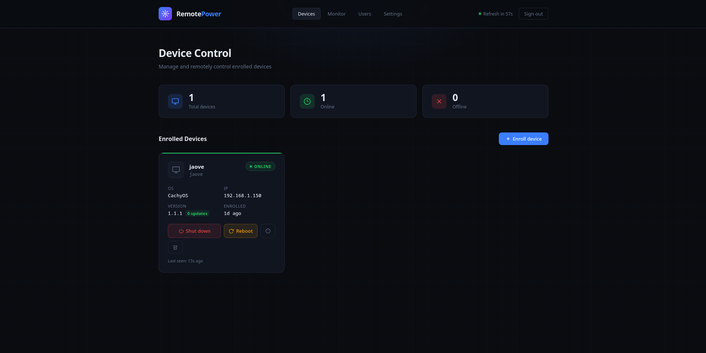
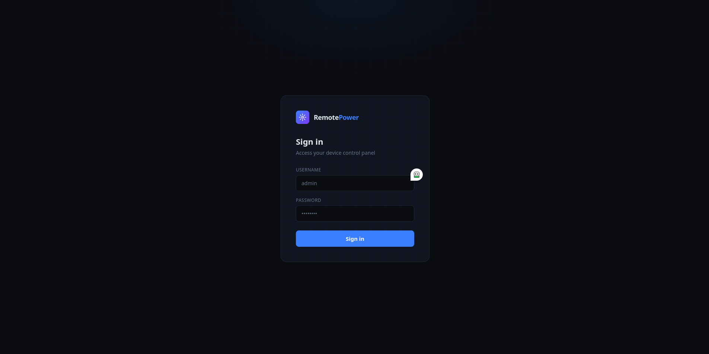
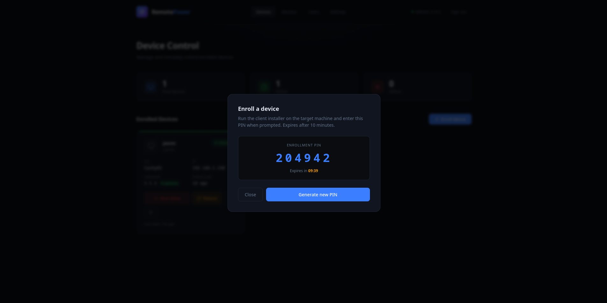
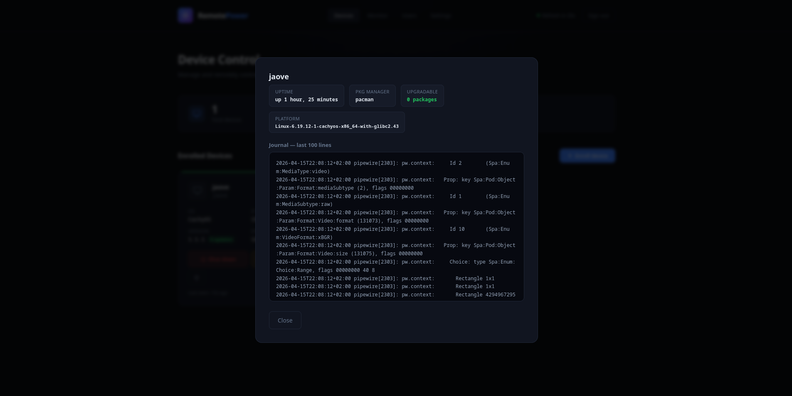
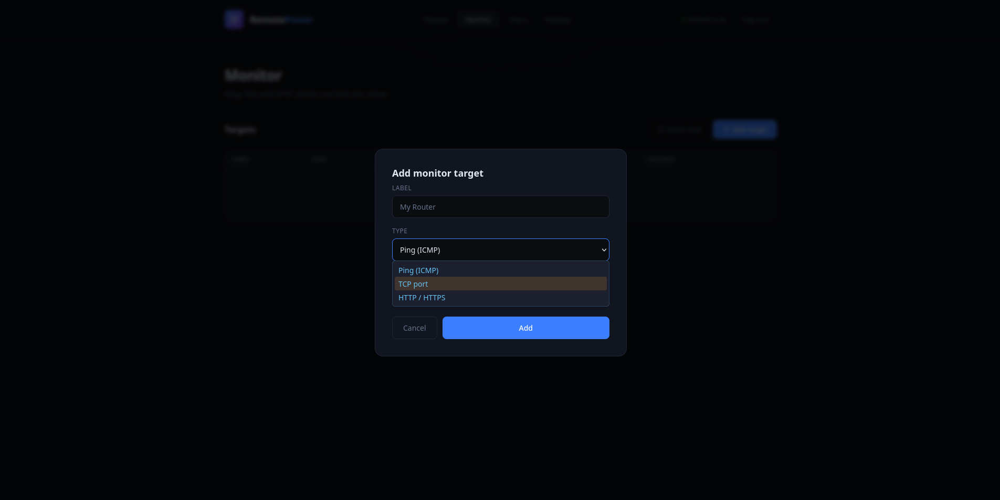
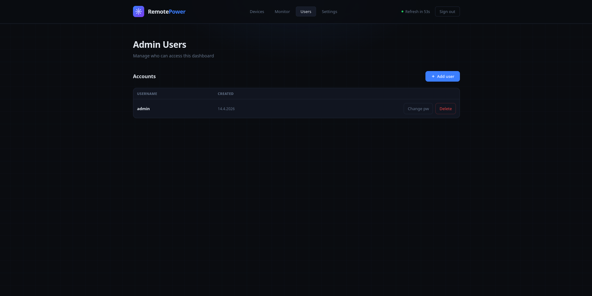
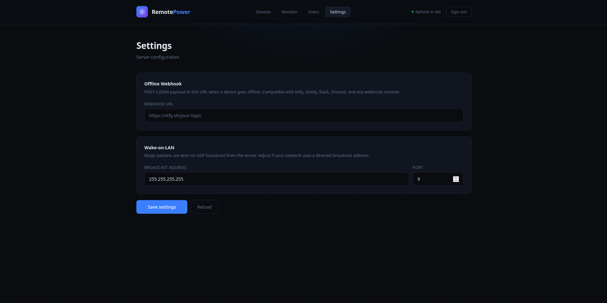

# RemotePower

<div align="center">



**Remote device management over HTTPS — no open inbound firewall ports on clients required.**

[](LICENSE)
[](https://kernel.org)
[](https://nginx.org)
[](https://python.org)

</div>

---

## What is RemotePower?

RemotePower is a self-hosted web dashboard for remotely managing Linux machines on your network. It works by having a lightweight agent on each client machine that **polls** the server — meaning clients only make outbound connections. No inbound firewall rules needed on the clients.

Enrollment works like [Moonlight/Sunshine](https://moonlight-stream.org/): generate a PIN in the dashboard, run the client installer, enter the PIN — done.

---

## Screenshots

<table>
  <tr>
    <td align="center"><b>Login</b></td>
    <td align="center"><b>Dashboard</b></td>
    <td align="center"><b>Enroll device</b></td>
    <td align="center"><b>Device detail</b></td>
  </tr>
  <tr>
    <td></td>
    <td></td>
    <td></td>
    <td></td>
  </tr>
  <tr>
    <td align="center"><b>Monitor</b></td>
    <td align="center"><b>Users</b></td>
    <td align="center"><b>Settings</b></td>
    <td></td>
  </tr>
  <tr>
    <td></td>
    <td></td>
    <td></td>
    <td></td>
  </tr>
</table>

---

## Features

- 🟢 **Live status** — green/red indicator per device, auto-refreshes every 60s
- 🔐 **bcrypt auth** — bcrypt password hashing with transparent SHA-256 upgrade on login
- 👥 **Multiple admin users** — add/remove admins from the dashboard
- 📟 **PIN enrollment** — 6-digit PIN, single-use, expires in 10 minutes
- 🔌 **No inbound firewall rules** — client polls server, not the other way around
- 🐧 **systemd integration** — client runs as a proper daemon, auto-starts on boot
- 🏠 **Self-hosted** — your server, your data, flat JSON files, no database
- 🔒 **HTTPS ready** — works with Let's Encrypt / acme.sh out of the box
- ⚡ **Lightweight** — Nginx + Python CGI, no Node.js, no Docker required
- 🔁 **Reboot command** — queue reboot alongside shutdown
- ⚡ **Wake-on-LAN** — send magic packet from dashboard, MAC stored at enroll time
- 🔔 **Offline webhook** — POST to Ntfy, Gotify, Slack, Discord when a device goes offline
- 📦 **Patch info** — pending update count via apt/dnf/pacman, reported every ~10 min
- ⏱ **Uptime** — reported by client agent
- 📋 **Journal** — last 100 journalctl lines per device, viewable in dashboard
- 📡 **Ping / service monitor** — ICMP ping, TCP port, HTTP checks from the server
- 🔄 **Agent self-update** — agents update themselves automatically, no SSH needed

---

## Architecture

```
Browser ──HTTPS──► Nginx (your server)
                      │
                      ├─ /              → Dashboard (HTML/CSS/JS, no framework)
                      ├─ /api/*         → Python CGI backend (via fcgiwrap)
                      ├─ /agent/        → Agent binary (static, for self-update)
                      └─ /var/lib/remotepower/
                              ├── users.json      # bcrypt password hashes
                              ├── devices.json    # enrolled devices + sysinfo cache
                              ├── tokens.json     # browser session tokens
                              ├── pins.json       # pending enrollment PINs
                              ├── commands.json   # pending command queue per device
                              └── config.json     # webhook, WoL, monitor targets

Client machine (CachyOS, Ubuntu, Debian, Arch, Fedora, etc.)
  └─ systemd: remotepower-agent.service
       └─ Python daemon
            └─ POST /api/heartbeat every 60s
                 ├─ receives commands: shutdown | reboot
                 └─ sends sysinfo + journal every 10th poll (~10 min)
```

**Why polling instead of push?**
- Zero firewall config on clients
- Works behind NAT, VPNs, double-NAT
- Clients can be on completely different networks as long as they reach the server URL

---

## Quick Start

### Prerequisites (server)

- Linux server with a public or LAN IP
- Nginx + Python 3.8+ + fcgiwrap

### 1. Clone

```bash
git clone https://github.com/tyxak/remotepower
cd remotepower
```

### 2. Install server

```bash
sudo bash install-server.sh
```

The script will:
- Detect your distro (apt / dnf / pacman) and install dependencies
- Install `nginx`, `fcgiwrap`, `python3`, `bcrypt`
- Deploy the dashboard to `/var/www/remotepower/`
- Publish the agent binary to `/var/www/remotepower/agent/` for self-update
- Configure Nginx
- Create `/var/lib/remotepower/` for data storage
- Ask for your admin username and password

### 3. Enroll a client

**In the dashboard:**
1. Open `https://your-server/` → log in
2. Click **+ Enroll device** — a 6-digit PIN appears (valid 10 min)

**On the client machine:**
```bash
sudo bash install-client.sh
# Enter server URL and PIN when prompted
```

The device appears in the dashboard within 60 seconds.

---

## Upgrading

### Server

```bash
cd /path/to/remotepower
git pull origin main
sudo bash deploy-server.sh
```

`deploy-server.sh` redeploys `api.py`, `index.html`, `remotepower-passwd`, and the agent binary. It does **not** touch your Nginx config, `users.json`, or `config.json`.

### Clients

Clients self-update automatically within ~1 hour of a server deploy. To trigger immediately:

```bash
sudo remotepower-agent update
```

> **Note:** Clients running the original v1.0.0 agent do not have self-update. Those need a one-time manual update:
> ```bash
> sudo install -m 755 client/remotepower-agent /usr/local/bin/remotepower-agent
> sudo systemctl restart remotepower-agent
> ```

---

## New Features Guide

### Wake-on-LAN

The client agent reports its primary interface MAC address at enroll time. Offline devices show a **WoL** button in the dashboard. Configure the broadcast address and port in **Settings** (default: `255.255.255.255:9`).

### Reboot

Works identically to shutdown — queued on the server, executed on the next agent poll via `systemctl reboot`.

### Multiple admin users

Go to the **Users** tab to add or remove admin accounts. The last admin cannot be deleted.

### Offline Webhook

Configure a webhook URL in **Settings**. RemotePower POSTs a JSON payload when a device goes offline:

```json
{
  "event": "device_offline",
  "ts": 1712345678,
  "device_id": "abc123",
  "name": "mydesktop",
  "hostname": "mydesktop"
}
```

Compatible with Ntfy, Gotify, Slack incoming webhooks, Discord webhooks, n8n, Home Assistant, etc.

### Patch info & Uptime

The agent detects your package manager (apt / dnf / pacman) and reports upgradable package count every ~10 minutes using dry-run only — nothing is installed. Click **ⓘ** on any device card to view uptime and patch count.

### Journal

Click **ⓘ** on any device card to view the last 100 journalctl lines from that machine. Noisy system units (pipewire, audit, dbus) are filtered out automatically.

### Ping / Service Monitor

The **Monitor** tab lets you add targets the *server* checks:

| Type | Example | What it checks |
|------|---------|----------------|
| `ping` | `192.168.1.1` | ICMP echo |
| `tcp` | `192.168.1.5:22` | TCP connect |
| `http` | `https://myapp.internal` | HTTP HEAD, status < 400 |

### Agent self-update

After running `deploy-server.sh`, enrolled agents check for updates every ~1 hour. If the server has a newer version they download it, verify SHA-256, atomically replace themselves, and restart via systemd — no SSH required.

---

## HTTPS Setup

### With acme.sh

```nginx
server {
    listen 443 ssl;
    http2 on;
    server_name power.yourdomain.com;

    ssl_certificate     /root/.acme.sh/yourdomain.com/fullchain.cer;
    ssl_certificate_key /root/.acme.sh/yourdomain.com/yourdomain.com.key;
    ssl_trusted_certificate /root/.acme.sh/yourdomain.com/ca.cer;
    ssl_protocols TLSv1.2 TLSv1.3;
    ssl_session_cache shared:SSL:10m;
    ssl_stapling on;
    ssl_stapling_verify on;

    root /var/www/remotepower;
    index index.html;

    location /api/ {
        include fastcgi_params;
        fastcgi_pass unix:/run/fcgiwrap.socket;
        fastcgi_param SCRIPT_FILENAME /var/www/remotepower/cgi-bin/api.py;
        fastcgi_param PATH_INFO $uri;
        fastcgi_param REQUEST_METHOD $request_method;
        fastcgi_param CONTENT_TYPE $content_type;
        fastcgi_param CONTENT_LENGTH $content_length;
        fastcgi_param HTTP_X_TOKEN $http_x_token;
        fastcgi_param RP_DATA_DIR /var/lib/remotepower;
        limit_except GET POST DELETE { deny all; }
    }

    location /agent/ {
        root /var/www/remotepower;
        add_header Content-Disposition 'attachment; filename=remotepower-agent';
        add_header Content-Type application/octet-stream;
    }

    location / { try_files $uri $uri/ /index.html; }
    location ~* \.(json|tmp)$ { deny all; }
}

server {
    listen 80;
    server_name power.yourdomain.com;
    return 301 https://$host$request_uri;
}
```

### With Certbot

```bash
sudo apt install certbot python3-certbot-nginx
sudo certbot --nginx -d power.yourdomain.com
```

---

## API Reference

All authenticated endpoints require: `X-Token: <token>`

| Method | Endpoint | Auth | Description |
|--------|----------|------|-------------|
| `POST` | `/api/login` | — | Login, returns session token |
| `GET` | `/api/devices` | ✓ | List enrolled devices |
| `DELETE` | `/api/devices/:id` | ✓ | Remove a device |
| `GET` | `/api/devices/:id/sysinfo` | ✓ | Get cached sysinfo + journal |
| `POST` | `/api/enroll/pin` | ✓ | Generate enrollment PIN |
| `POST` | `/api/enroll/register` | — | Register device with PIN |
| `POST` | `/api/heartbeat` | device | Client keepalive + fetch commands |
| `POST` | `/api/shutdown` | ✓ | Queue shutdown for a device |
| `POST` | `/api/reboot` | ✓ | Queue reboot for a device |
| `POST` | `/api/wol` | ✓ | Send WoL magic packet |
| `GET` | `/api/monitor` | ✓ | Run ping/TCP/HTTP checks |
| `GET` | `/api/config` | ✓ | Get config |
| `POST` | `/api/config` | ✓ | Save config (webhook, WoL, monitors) |
| `GET` | `/api/users` | ✓ | List admin users |
| `POST` | `/api/users` | ✓ | Create admin user |
| `DELETE` | `/api/users/:name` | ✓ | Delete admin user |
| `POST` | `/api/users/passwd` | ✓ | Change password |
| `GET` | `/api/agent/version` | — | Current agent version + SHA-256 |

---

## Client Agent Commands

```bash
remotepower-agent status       # Show enrollment info, version, MAC
sudo remotepower-agent enroll  # Enroll / re-enroll interactively
sudo remotepower-agent update  # Force self-update check immediately
sudo remotepower-agent run     # Run in foreground (debug)

systemctl status remotepower-agent
journalctl -u remotepower-agent -f
systemctl restart remotepower-agent
```

---

## User Management

```bash
# Interactive menu: add, change password, delete, list
sudo python3 /var/www/remotepower/cgi-bin/remotepower-passwd
```

---

## Data Storage

All data in `/var/lib/remotepower/` (owned by `www-data`, mode `700`):

| File | Contents |
|------|----------|
| `users.json` | Admin accounts + bcrypt hashes |
| `devices.json` | Enrolled devices, MAC, cached sysinfo + journal |
| `tokens.json` | Active browser sessions (7-day TTL) |
| `pins.json` | Pending enrollment PINs |
| `commands.json` | Pending command queue per device |
| `config.json` | Webhook URL, WoL settings, monitor targets |

**Backup:**
```bash
sudo tar czf remotepower-backup-$(date +%F).tar.gz /var/lib/remotepower/
```

---

## Troubleshooting

**IPv6 error on nginx start**
```bash
sudo sed -i '/listen \[::\]/d' /etc/nginx/sites-available/remotepower
sudo nginx -t && sudo systemctl reload nginx
```

**fcgiwrap socket permission denied**
```bash
sudo chmod 660 /run/fcgiwrap.socket
sudo chown www-data:www-data /run/fcgiwrap.socket
sudo systemctl restart fcgiwrap nginx
```

**Device shows offline after enrolling**
```bash
journalctl -u remotepower-agent -f
curl -v https://your-server/api/heartbeat
```

**Shutdown/reboot queued but nothing happens**
- Command executes on the client's next poll (up to 60s)
- Agent must run as root: `systemctl cat remotepower-agent | grep User`

**WoL not working**
- Enable WoL in BIOS/UEFI on the target machine
- Check broadcast address in Settings matches your subnet (e.g. `192.168.1.255`)
- Server must be on the same L2 network as the target

**Agent self-update fails**
- Check `/agent/` location block exists in your Nginx config
- Verify: `curl -I https://your-server/agent/remotepower-agent` → should return `200`

**Reset everything**
```bash
sudo rm -rf /var/lib/remotepower/
sudo systemctl restart nginx fcgiwrap
sudo python3 /var/www/remotepower/cgi-bin/remotepower-passwd
```

---

## Security Notes

- Use HTTPS for anything internet-facing
- Session tokens expire after 7 days
- Enrollment PINs are single-use, expire after 10 minutes
- Device tokens are 256-bit random secrets
- Passwords stored as **bcrypt** (cost 12); old SHA-256 hashes auto-upgraded on next login
- Webhook URL stored server-side only, never returned to the browser

---

## File Layout

```
remotepower/
├── README.md
├── LICENSE
├── CHANGES.md
├── install-server.sh       # First-time server install (apt/dnf/pacman)
├── install-client.sh       # First-time client install + enrollment
├── deploy-server.sh        # Fast redeploy after git pull
├── server/
│   ├── html/index.html     # Dashboard (vanilla HTML/CSS/JS, no framework)
│   ├── cgi-bin/api.py      # REST API (Python 3, CGI via fcgiwrap)
│   ├── conf/remotepower.conf  # Nginx site config
│   └── remotepower-passwd  # User management utility
├── client/
│   ├── remotepower-agent           # Polling daemon (Python 3)
│   └── remotepower-agent.service   # systemd unit
└── docs/
    └── screenshots/
```

---

## License

MIT — see [LICENSE](LICENSE)

<div align="center"><sub>Made with ☕ and vi</sub></div>
