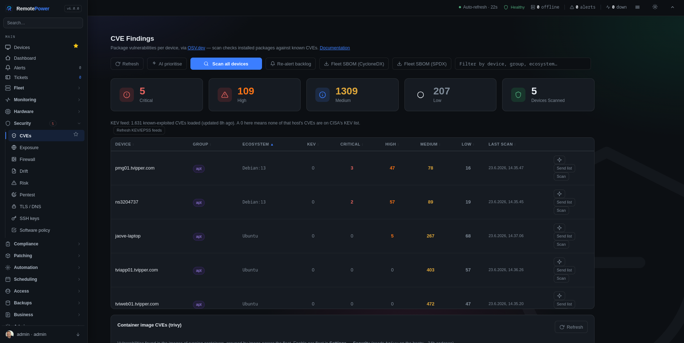
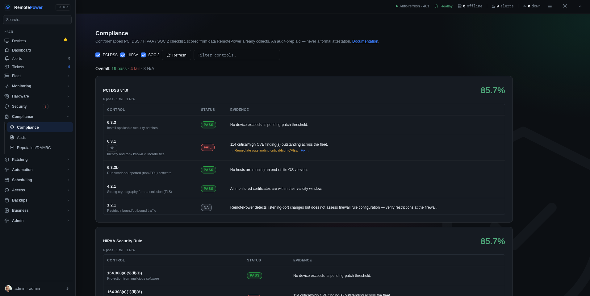
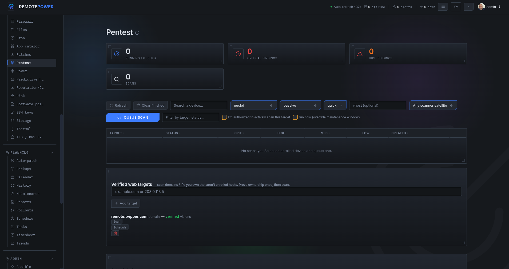
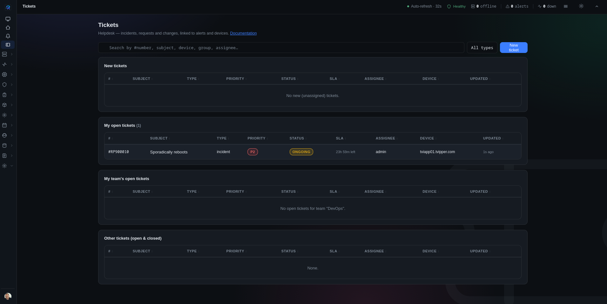
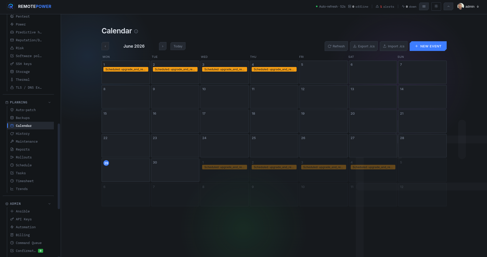
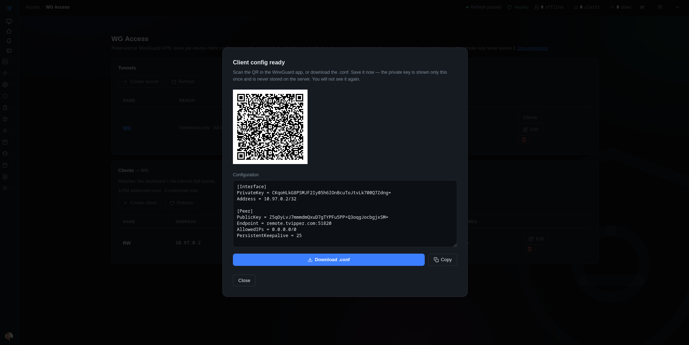

# RemotePower

<div align="center">


**The all-in-one, Swiss-army-knife control plane for your Linux fleet — and your homelab.**
Monitoring with alerting, a CMDB, documentation with RAG search, CVE scanning, patching
and remote management in one self-hosted place — with AI woven through all of it (optional).
Web dashboard, push-based agents, no inbound ports. Set it up in five minutes.

[](LICENSE)
[](https://kernel.org)
[](docs/install.md#docker-one-liner-alternative)
[](https://nginx.org)
[](https://python.org)
[](https://github.com/tyxak/remotepower/releases)
[](https://github.com/tyxak/remotepower/wiki)
[](https://github.com/tyxak/remotepower/discussions)

[Live demo](https://demoremote.tvipper.com) · [Install](docs/install.md) · [Features](docs/features.md) · [Wiki](https://github.com/tyxak/remotepower/wiki) · [Discussions](https://github.com/tyxak/remotepower/discussions) · [The story](HISTORY.md)

<a href="https://demoremote.tvipper.com"></a>

<details>
<summary><b>Click-through gallery — more screenshots</b></summary>

<br>

<table>
<tr>
<td align="center"><b>Dashboard</b><br><a href="docs/screenshots/Dash.png"></a></td>
<td align="center"><b>Fleet overview</b><br><a href="docs/screenshots/Index.png"></a></td>
</tr>
<tr>
<td align="center"><b>Monitoring</b><br><a href="docs/screenshots/Monitoring.png"></a></td>
<td align="center"><b>Device metrics</b><br><a href="docs/screenshots/Metrics.png"></a></td>
</tr>
<tr>
<td align="center"><b>CVEs</b><br><a href="docs/screenshots/CVEs.png"></a></td>
<td align="center"><b>Patches</b><br><a href="docs/screenshots/Patches.png"></a></td>
</tr>
<tr>
<td align="center"><b>Compliance</b><br><a href="docs/screenshots/Compliance.png"></a></td>
<td align="center"><b>Pentest</b><br><a href="docs/screenshots/Pentest.png"></a></td>
</tr>
<tr>
<td align="center"><b>CMDB</b><br><a href="docs/screenshots/CMDB.png"></a></td>
<td align="center"><b>Settings</b><br><a href="docs/screenshots/Settings.png"></a></td>
</tr>
<tr>
<td align="center"><b>AI assistant</b><br><a href="docs/screenshots/AI.png"></a></td>
<td align="center"><b>Tickets (helpdesk)</b><br><a href="docs/screenshots/Tickets.png"></a></td>
</tr>
<tr>
<td align="center"><b>Calendar</b><br><a href="docs/screenshots/Calendar.png"></a></td>
<td align="center"><b>WG Access (VPN)</b><br><a href="docs/screenshots/WG.png"></a></td>
</tr>
<tr>
<td align="center"><b>Browser SSH terminal</b><br><a href="docs/screenshots/Terminal.png"></a></td>
<td></td>
</tr>
</table>

</details>

</div>

---

## What is it?

**One tool instead of six.** Most teams stitch together a monitor, a CMDB, a wiki,
a vulnerability scanner, a patch tool and an SSH jump box. RemotePower is the
Swiss-army-knife that does all of it from a single host you control — **monitoring
&amp; alerting**, an asset **CMDB**, **documentation with RAG search** over your own
fleet, **CVE scanning**, **patching**, and **remote management** — and it's **heavily
bound to AI as an option**: bring your own model (local Ollama/LocalAI or a cloud
provider) and ask questions answered from *your* infrastructure, or leave it off
entirely. Everything stays self-hosted.

A web dashboard that manages your Linux machines (and Windows, kind of) without
opening firewall ports on them. Each host runs a small Python agent that **polls**
the central server every 60 seconds — outbound HTTPS only. Enrolment is a 6-digit
PIN, like pairing a console controller.

Deliberately small and **readable**: nginx + Python (gunicorn + Flask) on the
server, **plain vanilla JS in the browser** — around **~87,000 lines** of server
Python, one HTML file, one CSS file and a handful of JS files, no React/Vue/
Angular, no JSX, no build step, no bundler, no transpiling. No Node.js, no
Redis, no Kubernetes either — you can read every line. A single
`install-server.sh` run or `docker compose up` provisions the full single-node
stack by default: **PostgreSQL**, the app server, an out-of-band maintenance
scheduler and a co-located scanner satellite — no flags required. The whole
`/var/lib/remotepower/` directory backs up with `tar`. Tested on real homelabs
running 5–50 devices, fine up to a few hundred, and for constrained/dev installs
you can opt back down to the lightweight flat-JSON backend
(`--no-postgres`) — or scale further up with failover + read replicas,
load-balanced **app nodes** and **relay satellites** for segmented networks. See
**[docs/scaling.md](docs/scaling.md)**.

## Quick start

**Server — one command, HTTPS out of the box:**

```bash
# Docker (recommended). Self-signed HTTPS on first boot; the one-time admin
# password is printed to `docker logs remotepower`.
docker compose up -d

# Or bare-metal: a single wizard installs nginx + the app + TLS + admin.
# You never edit an nginx file — it writes the vhost and certificate for you.
git clone https://github.com/tyxak/remotepower && cd remotepower
sudo bash install.sh
```

Open the printed URL and log in. HTTPS is automatic — a self-signed CA by
default (agents pin it), or a real Let's Encrypt cert when you give a public
domain. No cert wrangling, no nginx editing.

**Add a device — one line, nothing to configure:**

In the dashboard, *Add device → Quick install command*, then on the target host:

```bash
wget -qO- "https://your-server/install?t=<token>" | sudo sh
```

It downloads the **signed** agent, verifies its checksum, enrols with the baked
one-time token, and the host appears in the dashboard **by its hostname** within
~60 seconds. Prefer Docker? *Add device → Generate Docker compose*. Onboarding
many hosts? Push the installer over SSH: `install.sh agent push user@h1 user@h2 …`.

**Uninstall:** `sudo bash install.sh uninstall` (server — keeps your data;
`--purge` to wipe it) · `wget -qO- https://your-server/install | sudo sh -s -- --uninstall` (agent).

For longer paths (Windows client, demo vhost, Ansible, advanced TLS), see
**[docs/install.md](docs/install.md)**.

### Try the live demo

A read-only demo deployment runs at **<https://demoremote.tvipper.com>** —
seeded with synthetic devices, alerts, CVE findings, and metrics so you can poke
around without installing anything. Login: **`demo`** / **`demo`** (reset every
few hours, so feel free to break things).

## What you can do with it

One tool instead of six — the ten things it does best:

| | |
|---|---|
| **Monitor everything** | Live 60-second metrics, a CheckMK-style per-host **Checks** page, active monitors (HTTP / DNS / ICMP / TCP + credential-less DB liveness), and a composable dashboard. Every fired event lands in an **Alerts inbox** with acknowledge / auto-resolve / **per-alert mute** and a **Tuning** page that surfaces the noisiest alerts. |
| **See every signal** | SMART & hardware health, **GPU** (NVIDIA + AMD, trend sparklines + thermal alerts), power / UPS, disk-fill **forecasting**, a per-host **timeline**, and logs with regex search — telemetry the agent already reports, surfaced as first-class views. |
| **Manage remotely** | Shell, multi-line **Custom Scripts** with dry-run lint, batch & scheduled runs, a real **browser SSH terminal** and **VNC** over the same tunnel, an opt-in **agent file manager** (browse / view / edit host files, no SSH), **cron & systemd-timer** management, **Proxmox** VM / LXC create plus **VMware & OpenShift** guest lifecycle (power / snapshots), and host user / key / firewall edits — all with **zero inbound ports**. |
| **Lock it down** | Passkeys / WebAuthn, SAML / OIDC / LDAP, TOTP + recovery codes, per-role **MFA enforcement**, a **tamper-evident** (hash-chained) audit log, strict CSP, and SSRF-guarded outbound calls. |
| **Scan for CVEs** | OSV.dev-backed, CVSS-scored, prioritized by CISA **KEV** + **EPSS** (exploited-in-the-wild first), with **SBOM** export (CycloneDX / SPDX, VEX-style vulnerabilities embedded). |
| **Pentest what you own** | Authorized vulnerability scanning of your own hosts & domains — nuclei / nikto / nmap / **OWASP ZAP** / wapiti / lynis — on a hardened scanner satellite, authorization-gated and schedulable. |
| **CMDB + RAG search** | Asset DB, **encrypted credentials vault**, Markdown docs per asset, a **Knowledge Base** of runbooks / SOPs, network map — and an AI assistant whose **RAG** answers from *your* fleet and docs and cites the source (local or cloud model; off by default). |
| **Stay compliant** | **OpenSCAP** CIS / STIG / PCI scans with downloadable HTML reports, plus PCI / HIPAA / SOC 2 control mapping and scheduled posture reports. |
| **Integrate** | 40 **homelab-app** health connectors (Pi-hole, TrueNAS, the *arr suite, …) plus a code-free **custom HTTP-probe** plugin to turn any endpoint into a signal, Prometheus / Grafana / Uptime-Kuma endpoints, inbound webhooks & syslog, and an **MCP server** so an AI client can query your fleet. |
| **Deploy & automate** | An **app catalog** — one-click Docker Compose deploy of curated (or your own custom) self-contained apps to a host — auto-patch policies (cron, per group / tag / site, maintenance-aware), config-**drift** detection, ACME / Let's Encrypt, backup orchestration, an **IaC generator** (Terraform / Ansible / Pulumi / …), and a **Provisioning** blueprint catalog that renders — or runs Terraform (Plan / Apply / Destroy) — server-side. |

**Full feature inventory → [docs/features.md](docs/features.md).**
**Step-by-step recipes → [docs/cookbook.md](docs/cookbook.md).**

### Recent releases

- **v6.1.0 "Runt1meMatters"** — the enterprise-productization release. **Postgres, the out-of-band scheduler, and a co-located scanner satellite are now the single-node default** (`install-server.sh` and `docker-compose.yml` — `--no-postgres`/`--no-scheduler`/`--no-scanner` opt back down), and **the server runs entirely on gunicorn + Flask** — the CGI (`fcgiwrap`) entry point and the SCGI prefork worker are retired, every shipped nginx config proxies straight to the app server, and a fresh install migrates its bootstrap data into Postgres automatically. Fixed a latent bug where the `/install` one-line agent installer could silently point at the wrong host under a persistent server. No breaking API changes.
- **v6.0.1 "RefineMatters" — 2026-07-08** — a refinement release: a broad polish, hardening and correctness pass over the whole product. Sidebar reorganised (Virtualization/Containers under **Fleet**, Integrations under **Monitoring**, App catalog under **Automation**; every sub-menu sorted alphabetically); a **real world map** on the Sites page; **single-device auto-patch** targets; the App catalog as a full sortable table; a dedicated **Service baselines** card; **PDF** patch-report export; and consistent button sizing throughout. **Certificate expiry now raises an alert** by default, plus two new alerts — **read-only remount** (silent data-loss) and **mail-queue backlog** — and two alert-resolution fixes. Extra defense-in-depth on outbound vuln-DB/registry lookups, faster heartbeats, and refreshed documentation. No breaking changes.
- **v6.0.0 "ClarityMatters" — 2026-07-05** — the v6 interface overhaul. One flat, modern UI replaces the Industrial New-UI/Old-UI toggle (system fonts, hairline panels, accent-soft active states); the sidebar is regrouped into **12 domains** as a one-open-at-a-time accordion and **Settings** gets a left-nav; **Tickets, Billing, Provisioning, the host File manager and the Knowledge base are now standard, always-on modules** (server-side Terraform execution stays an explicit admin switch); an optional **auto-hide sidebar** (on by default, revealed while alerts are open), a faint per-page watermark, and consistent headings/buttons/typography throughout; **every page links its own documentation**. Folds in the accumulated backend work — built-in **TLS/DANE expiry schedule**, **SNMPv3 (USM)** polling for agentless devices, and the **GitHub issue monitor** connector. Security: a whole-project audit + full SAST (CodeQL 0) with three Medium and several Low fixes — no Critical/High/Medium ships. No breaking API changes.
- **v5.7.0 — F4ct0rMatters** — a refactor-and-fix release. Fixes five New-UI bugs reported by @AndiBSE — devices can be **deleted** again, the profile menu is readable in **light mode**, the **accent picker** and full **themes** work in the New UI, and the accent reaches chamfered buttons — plus a **mobile/narrow-viewport** pass (no horizontal scroll at phone width). Adds **ticket lifecycle events**, **whole-tree config-secret encryption** and **multi-table Postgres RLS** (both opt-in, default-off). Faster to start (lazy `<template>` pages, parallel fonts, nav preload) on a much slimmer, modular server (`api.py` ~57k→~52k lines). No breaking changes.
- **v5.6.0 — HeapMatters** — the IaC / automation + alert-tuning release. An opt-in **Provisioning** page (Admin → Provisioning): a folder-tree **catalog of infrastructure blueprints** — Terraform, cloud-init, Ansible, iPXE — that you fill in and **render** (copy/download; cloud-init can bake the agent install one-liner), or **run Terraform server-side** — **Plan / Apply / Destroy** — behind a separate execute gate, with persistent per-blueprint state, a run lock, and secrets passed as environment (never to disk). The standalone Ansible runner folds in here. Plus an **alert Tuning** page (Monitoring → Tuning) that surfaces the noisiest alerts from the timeline with a per-host **mute** (the Alerts/dashboard Ack button becomes an **X mute** silencing one exact alert from one host), and **timesheet watchers** — let specific non-finance users view another user's hours, by user or whole team. Also: **virtualization lifecycle beyond Proxmox** — VMware (vSphere/vCenter, Cloud Director) and OpenShift Virtualization now get list / power / snapshot control on the Virtualization page; an opt-in **Knowledge Base** (operator-authored SOPs/runbooks, searchable, fed to the AI as a RAG source); and three new automation actions (open a ticket, add a tag, mute the alert). Everything opt-in, default-off — no breaking changes.
Full release history, newest first → **[CHANGELOG.md](CHANGELOG.md)**.

## Security

RemotePower is security-reviewed every few releases and **independently pentested
clean** — the latest full run (Bandit SAST; OWASP ZAP, Nikto, Nuclei, Wapiti,
WhatWeb DAST) reported **no exploitable findings**. Posture in brief: bcrypt
(cost 12, PBKDF2-HMAC-SHA256 fallback) behind rate-limited login; TOTP 2FA with
recovery codes; passkeys / SAML / OIDC / LDAP; 256-bit header session tokens
(CSRF-safe by construction); a strict CSP with no `'unsafe-inline'`; an AES-GCM
CMDB vault; a tamper-evident audit log; and mandatory TLS verification plus
connect-time anti-DNS-rebinding on every outbound call. Full posture, threat
model, review history and an operator hardening checklist:
**[docs/security.md](docs/security.md)**.

## Documentation

Browse the full docs in the **[Wiki](https://github.com/tyxak/remotepower/wiki)**
(generated from `docs/`, organised by topic). Prefer the source? Everything lives
in **[docs/](docs/)** — start with the index there. The essentials:

| Topic | Where |
|---|---|
| **Install** (Linux, Docker, demo, Windows) | [docs/install.md](docs/install.md) |
| **Full feature inventory** | [docs/features.md](docs/features.md) |
| **Architecture + on-disk layout** | [docs/architecture.md](docs/architecture.md) |
| **API reference** (endpoints + OpenAPI) | [docs/api.md](docs/api.md) — interactive: `/swagger.html` |
| **Security notes** | [docs/security.md](docs/security.md) |
| **Scaling & deployment** | [docs/scaling.md](docs/scaling.md) |
| **Troubleshooting / Upgrading** | [docs/troubleshooting.md](docs/troubleshooting.md) · [docs/upgrading.md](docs/upgrading.md) |

## TL;DR

A self-hosted Swiss-army knife for your Linux fleet or homelab: monitoring,
alerting, CMDB, docs with **RAG**, CVE scanning, authorized pentesting, patching,
compliance, and full remote management (browser SSH, Proxmox, files) — push-based
agents, **zero inbound ports**, optional **local or cloud AI** that answers from
*your* hosts. One tool instead of six.

## Contributing & community

- **Request a feature** — open a [Feature request](https://github.com/tyxak/remotepower/issues/new?template=feature_request.yml); it's labelled `enhancement` and triaged from there.
- **Report a bug** — open a [Bug report](https://github.com/tyxak/remotepower/issues/new?template=bug_report.yml).
- **Ask a question or float an idea** — head to [Discussions](https://github.com/tyxak/remotepower/discussions).
- **Found a security issue?** — please report it privately per [SECURITY.md](SECURITY.md); don't open a public issue.
- **Contributing code or docs?** — see [CONTRIBUTING.md](CONTRIBUTING.md).

## License

MIT — see [LICENSE](LICENSE).

<div align="center"><sub>Made with care and vi</sub></div>
