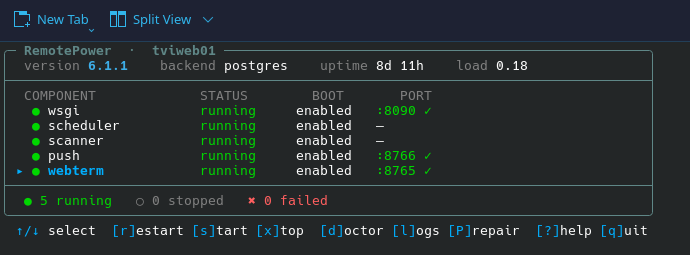

# RemotePower

<div align="center">


**The Swiss-army-knife control plane for your Linux fleet — Windows and macOS
too — or your homelab.** Monitoring, alerting, a CMDB, CVE scanning, patching,
and remote management, all self-hosted in one place — with optional AI woven
through it. Push-based agents that run as a supervised service on every OS, zero
inbound ports. Up and running in five minutes.

[](LICENSE)
[](https://kernel.org)
[](docs/install.md#docker-one-liner-alternative)
[](https://nginx.org)
[](https://python.org)
[](https://github.com/tyxak/remotepower/releases)
[](https://github.com/tyxak/remotepower/wiki)
[](https://github.com/tyxak/remotepower/discussions)

[Live demo](https://demoremote.tvipper.com) · [Install](docs/install.md) · [Wiki](https://github.com/tyxak/remotepower/wiki) · [Changelog](CHANGELOG.md) · [Discussions](https://github.com/tyxak/remotepower/discussions) · [The story](HISTORY.md)

<a href="https://demoremote.tvipper.com"></a>

<details>
<summary><b>Screenshots</b></summary>
<br>
<table>
<tr>
<td align="center"><b>Dashboard</b><br><a href="docs/screenshots/Dash.png"></a></td>
<td align="center"><b>Fleet overview</b><br><a href="docs/screenshots/Index.png"></a></td>
</tr>
<tr>
<td align="center"><b>Monitoring</b><br><a href="docs/screenshots/Monitoring.png"></a></td>
<td align="center"><b>Device metrics</b><br><a href="docs/screenshots/Metrics.png"></a></td>
</tr>
<tr>
<td align="center"><b>CVEs</b><br><a href="docs/screenshots/CVEs.png"></a></td>
<td align="center"><b>Patches</b><br><a href="docs/screenshots/Patches.png"></a></td>
</tr>
<tr>
<td align="center"><b>Compliance</b><br><a href="docs/screenshots/Compliance.png"></a></td>
<td align="center"><b>Pentest</b><br><a href="docs/screenshots/Pentest.png"></a></td>
</tr>
<tr>
<td align="center"><b>CMDB</b><br><a href="docs/screenshots/CMDB.png"></a></td>
<td align="center"><b>Settings</b><br><a href="docs/screenshots/Settings.png"></a></td>
</tr>
<tr>
<td align="center"><b>AI assistant</b><br><a href="docs/screenshots/AI.png"></a></td>
<td align="center"><b>Tickets (helpdesk)</b><br><a href="docs/screenshots/Tickets.png"></a></td>
</tr>
<tr>
<td align="center"><b>Calendar</b><br><a href="docs/screenshots/Calendar.png"></a></td>
<td align="center"><b>WG Access (VPN)</b><br><a href="docs/screenshots/WG.png"></a></td>
</tr>
<tr>
<td align="center"><b>Browser SSH terminal</b><br><a href="docs/screenshots/Terminal.png"></a></td>
<td align="center"><b>rp — node control (TUI)</b><br><a href="docs/screenshots/TUI.png"></a></td>
</tr>
</table>
</details>

</div>

---

## What is it?

Most teams stitch together a monitor, a CMDB, a wiki, a vulnerability scanner,
a patch tool and an SSH jump box. RemotePower is one self-hosted tool that
does all of it — monitoring & alerting, an asset CMDB, documentation with RAG
search over your own fleet, CVE scanning, patching, and remote management —
with AI as an entirely optional layer on top (bring your own local or cloud
model, or leave it off).

Each host runs a small Python agent that polls the server over outbound
HTTPS only — nothing opens on the client, ever. Enrolment is a 6-digit PIN,
like pairing a controller. It runs supervised on every platform — a systemd
service on Linux, a launchd agent on macOS, and a **Windows service**
(services.msc, auto-restarting) on Windows, installed by a single elevated
one-liner. See [docs/windows-client.md](docs/windows-client.md) for the Windows
specifics.

Deliberately small and readable: nginx + Python (gunicorn/Flask) on the
server, plain vanilla JS in the browser — no React/Vue, no build step, no
Node.js, no Redis, no Kubernetes. `install-server.sh` or `docker compose up`
provisions the full stack — PostgreSQL, the app server, a maintenance
scheduler, a scanner satellite — with no flags required. A single small box
handles a couple hundred devices out of the box, no tuning needed — and the
*same* box carries several thousand agents with just the poll-interval and
worker-count knobs turned, before you'd ever reach for load-balanced app
nodes, read replicas or relay satellites. See
**[docs/scaling.md](docs/scaling.md)** for the capacity table and
**[docs/requirements.md](docs/requirements.md)** for hardware sizing.

## Quick start

**Server — one command, HTTPS out of the box:**

```bash
# Docker (recommended). Self-signed HTTPS on first boot; the one-time admin
# password is printed to `docker logs remotepower`.
docker compose up -d

# Or bare-metal: one wizard installs nginx + the app + TLS + admin.
git clone https://github.com/tyxak/remotepower && cd remotepower
sudo bash install.sh
```

Open the printed URL and log in — HTTPS is automatic (self-signed by
default, or Let's Encrypt if you give it a public domain). No nginx editing.

On the box, manage the stack with **`rp`** (omd/checkmk-style): `rp status`, the
live `rp tui` dashboard, and `sudo rp doctor` for a one-shot health check — see
[docs/cli.md](docs/cli.md).

**Add a device — one line:**

*Add device → Quick install command* in the dashboard, then on the target host:

```bash
wget -qO- "https://your-server/install?t=<token>" | sudo sh
```

The host appears in the dashboard within ~60 seconds. Onboarding many hosts?
`install.sh agent push user@h1 user@h2 …` pushes it over SSH.

**Upgrading?** `git pull origin main && sudo bash install.sh update` handles
both a plain code update and a legacy pre-6.1.0 conversion. Full paths
(Windows/macOS agents, demo vhost, advanced TLS, uninstall) →
**[docs/install.md](docs/install.md)** · **[docs/upgrading.md](docs/upgrading.md)**.

**Try it first:** a read-only demo runs at
**[demoremote.tvipper.com](https://demoremote.tvipper.com)**, seeded with
synthetic devices/alerts/CVEs. Login `demo` / `demo`, reset every few hours.

## What you can do with it

- **Monitor & alert** — live metrics, a CheckMK-style Checks page, active
  monitors (HTTP/DNS/ICMP/TCP), an Alerts inbox with ack/auto-resolve/mute.
- **See every signal** — SMART/hardware health, GPU, power/UPS, disk-fill
  forecasting, a per-host timeline, log search.
- **Manage remotely** — shell + Custom Scripts, a file manager and
  cron/systemd-timer control with zero inbound ports; plus a browser SSH
  terminal and VNC riding your existing SSH, and Proxmox/VMware/OpenShift
  guest lifecycle via the hypervisor's own API.
- **Lock it down** — passkeys/WebAuthn, SAML/OIDC/LDAP, TOTP, per-role MFA,
  a tamper-evident audit log, strict CSP.
- **Scan for CVEs** — OSV.dev-backed, CISA KEV + EPSS prioritized, SBOM
  export (CycloneDX/SPDX).
- **Pentest what you own** — authorized nuclei/nikto/nmap/ZAP/wapiti/lynis
  scans on a hardened scanner satellite.
- **CMDB + RAG search** — assets, an encrypted credentials vault, a
  Knowledge Base, and an AI assistant that cites *your* fleet's own data.
- **Stay compliant** — OpenSCAP CIS/STIG/PCI scans, PCI/HIPAA/SOC 2 mapping.
- **Integrate** — 42 connectors (homelab apps, hypervisors, and EDR — Wazuh,
  CrowdStrike, SentinelOne — cross-referenced to find hosts with no EDR at all)
  plus a code-free custom-HTTP-probe plugin, Prometheus/Grafana endpoints,
  webhooks, syslog, and an MCP server.
- **Deploy & automate** — a one-click app catalog, auto-patch policies,
  drift detection, ACME, backups, and a Terraform/Ansible provisioning catalog.

**Full feature inventory → [docs/features.md](docs/features.md).**
**Step-by-step recipes → [docs/cookbook.md](docs/cookbook.md).**

### Recent releases

- **v6.2.2 "Pu1seMatters"** — a performance and polish pass built around the
  heartbeat: agents skip re-sending unchanged inventory data (delta sysinfo)
  and reuse their HTTPS connection instead of a new TLS handshake per beat; a
  new always-on health check catches an agent whose sandbox hides kernel
  modules *before* patch day; re-running the installer now upgrades in place;
  and the UI gains a keyboard-driven alert inbox, device hover cards,
  tab-level device deep links and faster large-fleet tables.
- **v6.2.1 "In1tMatters"** — a critical fix for Linux hosts using initramfs
  (Debian/Ubuntu): systemd unit hardening could make upgrades run through
  RemotePower rebuild the initramfs **without kernel modules**, leaving the host
  unbootable at its next reboot. The unit is fixed, the upgrade command now
  refuses to run in that situation, and patch-window reboots verify the initrd
  (and a clean upgrade) before firing.
- **v6.2.0 "Daem0nMatters"** — the agent now runs as a first-class **supervised
  service on every OS** — a Windows service (services.msc, SCM auto-restart via
  pywin32), launchd `KeepAlive` on macOS, systemd on Linux — with full
  Windows-agent parity. Plus a wave of gap-closing that acts on signals already
  collected but never surfaced: a privileged-group tripwire
  (sudo/wheel/Administrators), Windows Defender AV posture (including
  real-time-protection-off), a USB physical-access tripwire, a host-wide
  disk-usage explorer ("disk 94% — of *what*?"), and a composite
  device-reliability prediction.
- **v6.1.2 "AfterglowMatters"** — a correctness-and-fit release: muting an alert
  now actually lifts the health score, the trivy image-CVE scan can finally be
  triggered, `POST /api/cve/scan` no longer 500s on Postgres, a sweep of frontend
  defects, the first wave of performance work, and optional modules a minimal
  homelab can switch off.
- **v6.1.1 "HardenMatters"** — a broad hardening pass: cross-tenant security
  fixes, step-up re-auth, litigation hold, a STRIDE threat model, a full
  WCAG AA accessibility pass, and real per-package patch pinning.
Full history, newest first → **[CHANGELOG.md](CHANGELOG.md)**.

## Security

Security-reviewed every few releases and independently pentested clean —
the latest full run (Bandit SAST; OWASP ZAP, Nikto, Nuclei, Wapiti, WhatWeb
DAST) reported no exploitable findings. bcrypt-hashed passwords behind
rate-limited login, TOTP/passkeys/SAML/OIDC/LDAP, a strict CSP with no
`unsafe-inline`, an AES-GCM CMDB vault, a tamper-evident audit log, and
mandatory TLS verification with anti-DNS-rebinding on every outbound call.
Full posture, threat model and review history →
**[docs/security.md](docs/security.md)**.

## Documentation

The **[Wiki](https://github.com/tyxak/remotepower/wiki)** is the browsable,
topic-organised home for everything — install guides, the full feature
reference, architecture, and the changelog. Prefer the source? It's all in
**[docs/](docs/README.md)** too. Quick links:

| Topic | Where |
|---|---|
| Install (Linux, Docker, Windows, macOS) | [docs/install.md](docs/install.md) |
| Full feature inventory | [docs/features.md](docs/features.md) |
| Architecture + on-disk layout | [docs/architecture.md](docs/architecture.md) |
| API reference (OpenAPI) | [docs/api.md](docs/api.md) — interactive: `/swagger.html` |
| Security notes | [docs/security.md](docs/security.md) |
| Scaling & deployment | [docs/scaling.md](docs/scaling.md) |
| Minimum/recommended hardware | [docs/requirements.md](docs/requirements.md) |
| Troubleshooting / Upgrading | [docs/troubleshooting.md](docs/troubleshooting.md) · [docs/upgrading.md](docs/upgrading.md) |

## Contributing & community

- **Request a feature** — open a [Feature request](https://github.com/tyxak/remotepower/issues/new?template=feature_request.yml).
- **Report a bug** — open a [Bug report](https://github.com/tyxak/remotepower/issues/new?template=bug_report.yml).
- **Ask a question or float an idea** — head to [Discussions](https://github.com/tyxak/remotepower/discussions).
- **Found a security issue?** — report it privately per [SECURITY.md](SECURITY.md); don't open a public issue.
- **Contributing code or docs?** — see [CONTRIBUTING.md](CONTRIBUTING.md).

## License

MIT — see [LICENSE](LICENSE).

<div align="center"><sub>Made with care and vi</sub></div>
