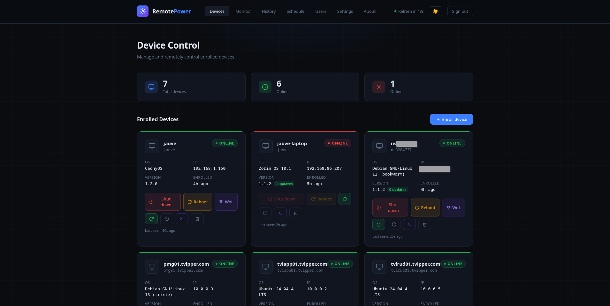
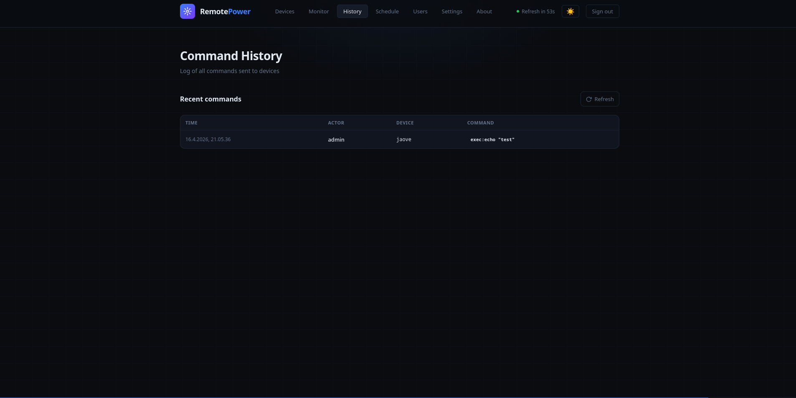
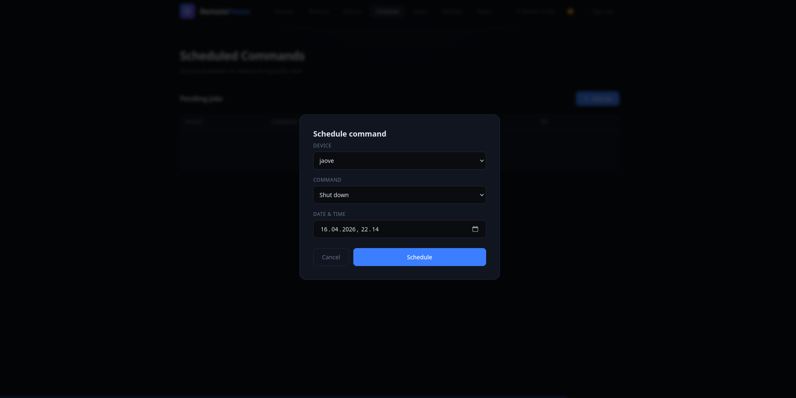
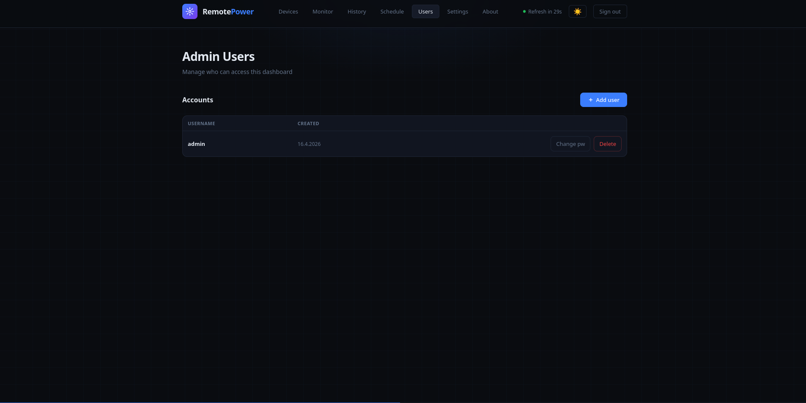
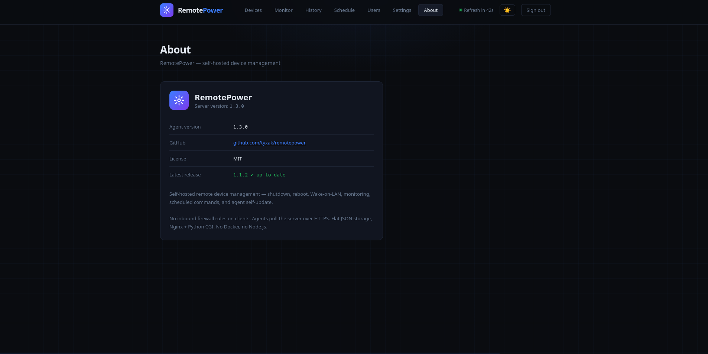

# RemotePower

<div align="center">



**Remote device management over HTTPS — no open inbound firewall ports on clients required.**

[](LICENSE)
[](https://kernel.org)
[](https://nginx.org)
[](https://python.org)
[](https://github.com/tyxak/remotepower/releases)

</div>

---

## What is RemotePower?

RemotePower is a self-hosted web dashboard for remotely managing Linux machines on your network. It works by having a lightweight agent on each client machine that **polls** the server — meaning clients only make outbound connections. No inbound firewall rules needed on the clients.

Enrollment works like [Moonlight/Sunshine](https://moonlight-stream.org/): generate a PIN in the dashboard, run the client installer, enter the PIN — done.

---

## Screenshots

<table>
  <tr>
    <td align="center"><b>Login</b></td>
    <td align="center"><b>Dashboard</b></td>
    <td align="center"><b>Enroll device</b></td>
    <td align="center"><b>Custom command</b></td>
  </tr>
  <tr>
    <td></td>
    <td></td>
    <td></td>
    <td></td>
  </tr>
  <tr>
    <td align="center"><b>Monitor</b></td>
    <td align="center"><b>Schedule</b></td>
    <td align="center"><b>Users</b></td>
    <td align="center"><b>Settings</b></td>
  </tr>
  <tr>
    <td></td>
    <td></td>
    <td></td>
    <td></td>
  </tr>
  <tr>
    <td align="center"><b>About</b></td>
    <td></td>
    <td></td>
    <td></td>
  </tr>
  <tr>
    <td></td>
    <td></td>
    <td></td>
    <td></td>
  </tr>
</table>

---

## Features

| Feature | Notes |
|---|---|
| 🟢 **Live status** | Green/red per device, auto-refreshes every 60s |
| 🔐 **bcrypt auth** | bcrypt password hashing, transparent SHA-256 upgrade on login |
| 👥 **Multiple admin users** | Add/remove admins from the dashboard |
| 📟 **PIN enrollment** | 6-digit PIN, single-use, expires in 10 minutes |
| 🔌 **No inbound firewall rules** | Client polls server, not the other way around |
| 🐧 **systemd integration** | Client runs as a proper daemon, auto-starts on boot |
| 🏠 **Self-hosted** | Flat JSON files, no database, no Docker required |
| 🔒 **HTTPS ready** | Works with Let's Encrypt / acme.sh out of the box |
| ⚡ **Lightweight** | Nginx + Python CGI, no Node.js |
| 🔁 **Reboot command** | Queue reboot alongside shutdown |
| ⚡ **Wake-on-LAN** | Magic packet from dashboard, unicast over VPN/routed networks |
| 🔔 **Offline webhook** | POST to Ntfy, Gotify, Slack, Discord when device goes offline |
| 📦 **Patch info** | Pending updates via apt/dnf/pacman, dry-run only |
| 📋 **Journal** | Last 100 journalctl lines per device, noise-filtered |
| 📡 **Ping / service monitor** | ICMP ping, TCP port, HTTP checks from the server |
| 📈 **Monitor history** | Uptime %, sparkline, last 50 check results per target |
| 🔄 **Agent self-update** | SHA-256 verified, atomic replace, no SSH needed |
| 🏷️ **Device tags** | Tag devices and filter dashboard by group |
| 🕐 **Scheduled commands** | Queue shutdown/reboot at a specific date and time |
| 📜 **Command history** | Every action logged with actor, device, and timestamp |
| 🖥️ **Custom commands** | Run arbitrary shell commands, output returned via next heartbeat |
| 🔔 **Patch alert** | Webhook when a device exceeds a configurable update threshold |
| 📊 **Uptime tracking** | Online/offline state changes stored per device |
| 🌙 **Dark/light mode** | Toggle in header, persisted per browser |
| ℹ️ **About page** | Server version, agent version, GitHub release check |

---

## Architecture

```
Browser ──HTTPS──► Nginx (your server)
                      │
                      ├─ /              → Dashboard (HTML/CSS/JS, no framework)
                      ├─ /api/*         → Python CGI backend (via fcgiwrap)
                      ├─ /agent/        → Agent binary (static, for self-update)
                      └─ /var/lib/remotepower/
                              ├── users.json            # bcrypt password hashes
                              ├── devices.json          # enrolled devices + sysinfo cache
                              ├── tokens.json           # browser session tokens
                              ├── pins.json             # pending enrollment PINs
                              ├── commands.json         # pending command queue per device
                              ├── config.json           # webhook, WoL, monitor targets
                              ├── history.json          # command log (last 200)
                              ├── schedule.json         # scheduled jobs
                              ├── uptime.json           # online/offline state changes
                              ├── monitor_history.json  # check results per target
                              └── cmd_output.json       # custom command output

Client machine (CachyOS, Ubuntu, Debian, Arch, Fedora, etc.)
  └─ systemd: remotepower-agent.service
       └─ Python daemon
            └─ POST /api/heartbeat every 60s
                 ├─ receives: shutdown | reboot | update | exec:<cmd>
                 ├─ sends sysinfo + journal every 10th poll (~10 min)
                 └─ sends patch count every 180th poll (~3 hr)
```

**Why polling instead of push?**
- Zero firewall config on clients
- Works behind NAT, VPNs, double-NAT
- Clients can be on completely different networks

---

## Quick Start

### Prerequisites (server)

- Linux server with a public or LAN IP
- Nginx + Python 3.8+ + fcgiwrap

### 1. Clone

```bash
git clone https://github.com/tyxak/remotepower
cd remotepower
```

### 2. Install server

```bash
sudo bash install-server.sh
```

Detects your distro (apt / dnf / pacman), installs dependencies, configures Nginx, creates the data directory, and sets up your first admin account.

### 3. Enroll a client

**In the dashboard:**
1. Open `https://your-server/` → log in
2. Click **+ Enroll device** — a 6-digit PIN appears (valid 10 min)

**On the client machine:**
```bash
sudo bash install-client.sh
# Enter server URL and PIN when prompted
```

The device appears in the dashboard within 60 seconds.

---

## Upgrading

### Server

```bash
cd /path/to/remotepower
git pull origin main
sudo bash deploy-server.sh
```

`deploy-server.sh` redeploys `api.py`, `index.html`, `remotepower-passwd`, and the agent binary. Does **not** touch your Nginx config, `users.json`, or `config.json`.

### Clients

Clients self-update automatically within ~1 hour. To trigger immediately:

```bash
sudo remotepower-agent update
# Or push from dashboard: click ↺ on any device card
```

---

## Feature Guide

### Wake-on-LAN
MAC is reported at enroll time. Sends unicast to the device's last known IP — works over routed networks and VPNs without broadcast forwarding.

### Device Tags & Filtering
Assign tags like `servers`, `homelab`, `workstations`. Tag filter buttons appear above the device grid.

### Scheduled Commands
The **Schedule** tab lets you queue a shutdown or reboot at a specific date and time.

### Custom Commands
Click `>_` on any device card to run an arbitrary shell command. Output returned on the next heartbeat (~60s).

### Offline Webhook

```json
{ "event": "device_offline",  "name": "mypc", "last_seen": 1712345678 }
{ "event": "device_online",   "name": "mypc" }
{ "event": "patch_alert",     "name": "mypc", "upgradable": 15, "threshold": 10 }
```

Compatible with Ntfy, Gotify, Slack, Discord, n8n, Home Assistant.

### Monitor History
Click ↗ on any monitor row — uptime %, sparkline of last 20 checks, scrollable table of last 50 results.

### Patch Alert
Settings → Patch Alert → set threshold (e.g. 10). Webhook fires when any device exceeds that count.

---

## HTTPS Setup

### With acme.sh

```nginx
server {
    listen 443 ssl;
    http2 on;
    server_name power.yourdomain.com;

    ssl_certificate     /root/.acme.sh/yourdomain.com/fullchain.cer;
    ssl_certificate_key /root/.acme.sh/yourdomain.com/yourdomain.com.key;
    ssl_trusted_certificate /root/.acme.sh/yourdomain.com/ca.cer;
    ssl_protocols TLSv1.2 TLSv1.3;
    ssl_session_cache shared:SSL:10m;
    ssl_stapling on;
    ssl_stapling_verify on;

    root /var/www/remotepower;
    index index.html;

    location /api/ {
        include fastcgi_params;
        fastcgi_pass unix:/run/fcgiwrap.socket;
        fastcgi_param SCRIPT_FILENAME /var/www/remotepower/cgi-bin/api.py;
        fastcgi_param PATH_INFO $uri;
        fastcgi_param REQUEST_METHOD $request_method;
        fastcgi_param CONTENT_TYPE $content_type;
        fastcgi_param CONTENT_LENGTH $content_length;
        fastcgi_param HTTP_X_TOKEN $http_x_token;
        fastcgi_param RP_DATA_DIR /var/lib/remotepower;
        limit_except GET POST DELETE PATCH { deny all; }
    }

    location /agent/ {
        root /var/www/remotepower;
        add_header Content-Disposition 'attachment; filename=remotepower-agent';
        add_header Content-Type application/octet-stream;
    }

    location / { try_files $uri $uri/ /index.html; }
    location ~* \.(json|tmp)$ { deny all; }
}

server {
    listen 80;
    server_name power.yourdomain.com;
    return 301 https://$host$request_uri;
}
```

### With Certbot

```bash
sudo apt install certbot python3-certbot-nginx
sudo certbot --nginx -d power.yourdomain.com
```

---

## API Reference

All authenticated endpoints require: `X-Token: <token>`

| Method | Endpoint | Auth | Description |
|--------|----------|------|-------------|
| `POST` | `/api/login` | — | Login, returns session token |
| `GET` | `/api/devices` | ✓ | List enrolled devices |
| `DELETE` | `/api/devices/:id` | ✓ | Remove a device |
| `PATCH` | `/api/devices/:id/tags` | ✓ | Set device tags |
| `GET` | `/api/devices/:id/sysinfo` | ✓ | Cached sysinfo + journal |
| `GET` | `/api/devices/:id/uptime` | ✓ | Uptime event history |
| `GET` | `/api/devices/:id/output` | ✓ | Custom command output |
| `POST` | `/api/enroll/pin` | ✓ | Generate enrollment PIN |
| `POST` | `/api/enroll/register` | — | Register device with PIN |
| `POST` | `/api/heartbeat` | device | Client keepalive + fetch commands |
| `POST` | `/api/shutdown` | ✓ | Queue shutdown |
| `POST` | `/api/reboot` | ✓ | Queue reboot |
| `POST` | `/api/update-device` | ✓ | Queue agent self-update |
| `POST` | `/api/wol` | ✓ | Send WoL magic packet |
| `POST` | `/api/exec` | ✓ | Queue custom shell command |
| `GET` | `/api/monitor` | ✓ | Run ping/TCP/HTTP checks |
| `GET` | `/api/monitor/history?label=X` | ✓ | Check history for a target |
| `GET` | `/api/schedule` | ✓ | List scheduled jobs |
| `POST` | `/api/schedule` | ✓ | Add scheduled job |
| `DELETE` | `/api/schedule/:id` | ✓ | Cancel scheduled job |
| `GET` | `/api/history` | ✓ | Command history log |
| `GET` | `/api/config` | ✓ | Get config |
| `POST` | `/api/config` | ✓ | Save config |
| `GET` | `/api/users` | ✓ | List admin users |
| `POST` | `/api/users` | ✓ | Create admin user |
| `DELETE` | `/api/users/:name` | ✓ | Delete admin user |
| `POST` | `/api/users/passwd` | ✓ | Change password |
| `GET` | `/api/agent/version` | — | Agent version + SHA-256 |
| `GET` | `/api/version` | ✓ | Server version + GitHub check |

---

## Client Agent Commands

```bash
remotepower-agent status       # Show enrollment info, version, all interfaces
sudo remotepower-agent enroll  # Enroll / re-enroll interactively
sudo remotepower-agent update  # Force self-update check immediately
sudo remotepower-agent run     # Run in foreground (debug)

systemctl status remotepower-agent
journalctl -u remotepower-agent -f
systemctl restart remotepower-agent
```

---

## User Management

```bash
# Interactive menu: add, change password, delete, list users + hash types
sudo python3 /var/www/remotepower/cgi-bin/remotepower-passwd
```

---

## Data Storage

All data in `/var/lib/remotepower/` (owned by `www-data`, mode `700`):

| File | Contents |
|------|----------|
| `users.json` | Admin accounts + bcrypt hashes |
| `devices.json` | Enrolled devices, MAC, cached sysinfo + journal |
| `tokens.json` | Active browser sessions (7-day TTL) |
| `pins.json` | Pending enrollment PINs |
| `commands.json` | Pending command queue per device |
| `config.json` | Webhook URL, WoL settings, monitor targets, patch threshold |
| `history.json` | Command log (last 200 entries) |
| `schedule.json` | Scheduled jobs |
| `uptime.json` | Online/offline state changes per device |
| `monitor_history.json` | Check results per monitor target (last 50) |
| `cmd_output.json` | Custom command output per device (last 100) |

**Backup:**
```bash
sudo tar czf remotepower-backup-$(date +%F).tar.gz /var/lib/remotepower/
```

---

## Troubleshooting

**IPv6 error on nginx start**
```bash
sudo sed -i '/listen \[::\]/d' /etc/nginx/sites-available/remotepower
sudo nginx -t && sudo systemctl reload nginx
```

**fcgiwrap socket permission denied**
```bash
sudo chmod 660 /run/fcgiwrap.socket
sudo chown www-data:www-data /run/fcgiwrap.socket
sudo systemctl restart fcgiwrap nginx
```

**Device shows offline after enrolling**
```bash
journalctl -u remotepower-agent -f
curl -v https://your-server/api/heartbeat
```

**Shutdown/reboot queued but nothing happens**
- Executes on the client's next poll (up to 60s)
- Agent must run as root: `systemctl cat remotepower-agent | grep User`

**WoL button missing**
- MAC is only stored for agents enrolled with v1.2+
- Re-enroll: `sudo remotepower-agent enroll`

**Custom command output not appearing**
- Output returned on next heartbeat (~60s) — check device detail modal

**Agent self-update fails**
```bash
curl -I https://your-server/agent/remotepower-agent  # should return 200
```

**Reset everything**
```bash
sudo rm -rf /var/lib/remotepower/
sudo systemctl restart nginx fcgiwrap
sudo python3 /var/www/remotepower/cgi-bin/remotepower-passwd
```

---

## Security Notes

- Use HTTPS for anything internet-facing
- Session tokens expire after 7 days
- Enrollment PINs are single-use, expire after 10 minutes
- Device tokens are 256-bit random secrets
- Passwords stored as **bcrypt** (cost 12); SHA-256 hashes auto-upgraded on next login
- Webhook URL stored server-side only, never returned to the browser
- Custom commands run as root — only grant dashboard access to trusted users

---

## File Layout

```
remotepower/
├── README.md
├── CHANGELOG.md
├── LICENSE
├── install-server.sh       # First-time server install (apt/dnf/pacman)
├── install-client.sh       # First-time client install + enrollment
├── deploy-server.sh        # Fast redeploy after git pull
├── server/
│   ├── html/index.html     # Dashboard (vanilla HTML/CSS/JS, no framework)
│   ├── cgi-bin/api.py      # REST API (Python 3, CGI via fcgiwrap)
│   ├── conf/remotepower.conf  # Nginx site config
│   └── remotepower-passwd  # User management utility
├── client/
│   ├── remotepower-agent           # Polling daemon (Python 3)
│   └── remotepower-agent.service   # systemd unit
├── tests/
│   ├── test_api.py         # API unit tests
│   └── test_agent.py       # Agent unit tests
└── docs/
    └── screenshots/
```

---

## License

MIT — see [LICENSE](LICENSE)

<div align="center"><sub>Made with ☕ and vi</sub></div>

