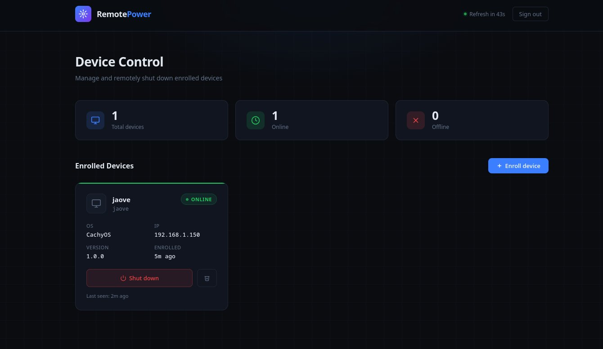
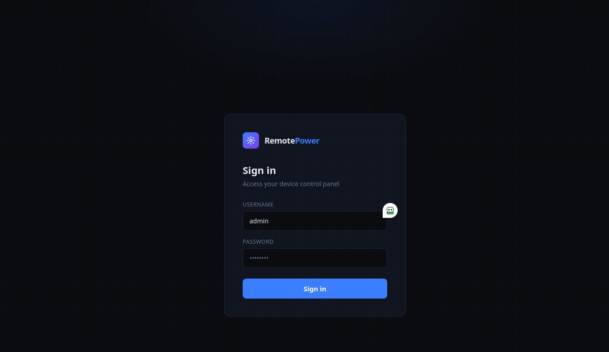
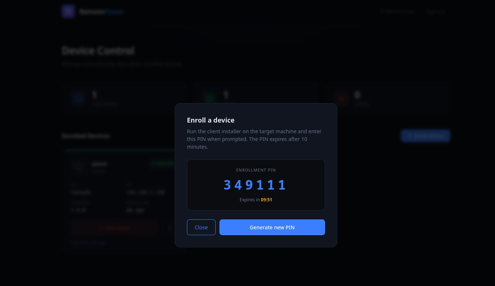

# RemotePower

<div align="center">



**Remote device shutdown over HTTPS — no open inbound firewall ports on clients required.**

[](LICENSE)
[](https://kernel.org)
[](https://nginx.org)
[](https://python.org)

</div>

---

## What is RemotePower?

RemotePower is a self-hosted web dashboard for remotely shutting down Linux machines on your network. It works by having a lightweight agent on each client machine that **polls** the server — meaning clients only make outbound connections. No inbound firewall rules needed on the clients.

Enrollment works like [Moonlight/Sunshine](https://moonlight-stream.org/): generate a PIN in the dashboard, run the client installer, enter the PIN — done.

---

## Screenshots

<table>
  <tr>
    <td align="center"><b>Login</b></td>
    <td align="center"><b>Dashboard</b></td>
    <td align="center"><b>Enroll device</b></td>
  </tr>
  <tr>
    <td></td>
    <td></td>
    <td></td>
  </tr>
</table>

---

## Features

- 🟢 **Live status** — green/red indicator per device, auto-refreshes every 60s
- 🔐 **Secure login** — flat-file auth with session tokens (7-day expiry)
- 📟 **PIN enrollment** — 6-digit PIN, single-use, expires in 10 minutes
- 🔌 **No inbound firewall rules** — client polls server, not the other way around
- 🐧 **systemd integration** — client runs as a proper daemon, auto-starts on boot
- 🏠 **Self-hosted** — your server, your data, flat JSON files, no database
- 🔒 **HTTPS ready** — works with Let's Encrypt / acme.sh out of the box
- ⚡ **Lightweight** — Nginx + Python CGI, no Node.js, no Docker required

---

## Architecture

```
Browser ──HTTPS──► Nginx (your server)
                      │
                      ├─ /              → Dashboard (HTML/CSS/JS, no framework)
                      ├─ /api/*         → Python CGI backend (via fcgiwrap)
                      └─ /var/lib/remotepower/   (flat JSON storage)
                              ├── users.json
                              ├── devices.json
                              ├── tokens.json
                              ├── pins.json
                              └── commands.json

Client machine (CachyOS, Ubuntu, Debian, Arch, etc.)
  └─ systemd: remotepower-agent.service
       └─ Python daemon
            └─ POST /api/heartbeat every 60s ──► receives 'shutdown' command
                                                  └─ systemctl poweroff
```

**Why polling instead of push?**
- Zero firewall config on clients
- Works behind NAT, VPNs, double-NAT
- Clients can be on completely different networks as long as they reach the server URL

---

## Quick Start

### Prerequisites (server)

- Linux server with a public or LAN IP
- Nginx + Python 3.8+ + fcgiwrap

### 1. Clone

```bash
git clone https://github.com/tyxak/remotepower
cd remotepower
```

### 2. Install server

```bash
sudo bash install-server.sh
```

The script will:
- Install `nginx`, `fcgiwrap`, `python3`
- Deploy the dashboard to `/var/www/remotepower/`
- Configure Nginx
- Create `/var/lib/remotepower/` for data storage
- Ask for your admin username and password

### 3. Enroll a client

**In the dashboard:**
1. Open `https://your-server/` → log in
2. Click **+ Enroll device** — a 6-digit PIN appears (valid 10 min)

**On the client machine:**
```bash
sudo bash install-client.sh
# Enter server URL and PIN when prompted
```

The device appears in the dashboard within 60 seconds.

---

## Manual Installation

### Server

```bash
# Dependencies
sudo apt-get install -y nginx fcgiwrap python3

# Directories
sudo mkdir -p /var/www/remotepower/cgi-bin
sudo install -d -m 700 /var/lib/remotepower
sudo chown www-data:www-data /var/lib/remotepower

# Files
sudo cp server/html/index.html /var/www/remotepower/
sudo install -m 755 server/cgi-bin/api.py /var/www/remotepower/cgi-bin/api.py

# Nginx
sudo cp server/conf/remotepower.conf /etc/nginx/sites-available/remotepower
sudo ln -sf /etc/nginx/sites-available/remotepower /etc/nginx/sites-enabled/remotepower
sudo nginx -t && sudo systemctl reload nginx

# fcgiwrap
sudo systemctl enable --now fcgiwrap fcgiwrap.socket

# Set admin password
sudo python3 server/remotepower-passwd
```

### Client

```bash
sudo install -m 755 client/remotepower-agent /usr/local/bin/remotepower-agent
sudo install -m 644 client/remotepower-agent.service /etc/systemd/system/
sudo remotepower-agent enroll
sudo systemctl daemon-reload
sudo systemctl enable --now remotepower-agent
```

---

## HTTPS Setup

### With acme.sh

Edit `/etc/nginx/sites-available/remotepower`:

```nginx
server {
    listen 443 ssl;
    http2 on;
    server_name power.yourdomain.com;

    ssl_certificate     /root/.acme.sh/yourdomain.com/fullchain.cer;
    ssl_certificate_key /root/.acme.sh/yourdomain.com/yourdomain.com.key;
    ssl_trusted_certificate /root/.acme.sh/yourdomain.com/ca.cer;
    ssl_protocols TLSv1.2 TLSv1.3;
    ssl_session_cache shared:SSL:10m;
    ssl_stapling on;
    ssl_stapling_verify on;

    root /var/www/remotepower;
    index index.html;

    location /api/ {
        include fastcgi_params;
        fastcgi_pass unix:/run/fcgiwrap.socket;
        fastcgi_param SCRIPT_FILENAME /var/www/remotepower/cgi-bin/api.py;
        fastcgi_param PATH_INFO $uri;
        fastcgi_param REQUEST_METHOD $request_method;
        fastcgi_param CONTENT_TYPE $content_type;
        fastcgi_param CONTENT_LENGTH $content_length;
        fastcgi_param HTTP_X_TOKEN $http_x_token;
        fastcgi_param RP_DATA_DIR /var/lib/remotepower;
        limit_except GET POST DELETE { deny all; }
    }

    location / { try_files $uri $uri/ /index.html; }
    location ~* \.(json|tmp)$ { deny all; }
}

server {
    listen 80;
    server_name power.yourdomain.com;
    return 301 https://$host$request_uri;
}
```

### With Certbot

```bash
sudo apt install certbot python3-certbot-nginx
sudo certbot --nginx -d power.yourdomain.com
```

---

## API Reference

All authenticated endpoints require: `X-Token: <token>`

| Method | Endpoint | Auth | Description |
|--------|----------|------|-------------|
| `POST` | `/api/login` | — | Login, returns session token |
| `GET` | `/api/devices` | ✓ | List enrolled devices with online status |
| `DELETE` | `/api/devices/:id` | ✓ | Remove a device |
| `POST` | `/api/enroll/pin` | ✓ | Generate enrollment PIN |
| `POST` | `/api/enroll/register` | — | Register device with PIN (called by client agent) |
| `POST` | `/api/heartbeat` | device token | Client keepalive + fetch pending commands |
| `POST` | `/api/shutdown` | ✓ | Queue shutdown command for a device |

### Examples

```bash
# Login
curl -X POST https://your-server/api/login \
  -H 'Content-Type: application/json' \
  -d '{"username":"admin","password":"yourpassword"}'
# → {"ok": true, "token": "abc123..."}

# List devices
curl https://your-server/api/devices -H 'X-Token: abc123...'

# Shutdown a device
curl -X POST https://your-server/api/shutdown \
  -H 'Content-Type: application/json' \
  -H 'X-Token: abc123...' \
  -d '{"device_id": "xK9mP2..."}'
```

---

## Client Agent Commands

```bash
remotepower-agent status           # Show enrollment info
sudo remotepower-agent enroll      # Enroll / re-enroll interactively
sudo remotepower-agent run         # Run in foreground (debug)

systemctl status remotepower-agent
journalctl -u remotepower-agent -f
systemctl restart remotepower-agent
```

---

## Changing Admin Password

```bash
sudo python3 /var/www/remotepower/cgi-bin/remotepower-passwd
```

---

## Data Storage

All data in `/var/lib/remotepower/` (owned by `www-data`, mode `700`):

| File | Contents |
|------|----------|
| `users.json` | Admin accounts + SHA-256 password hashes |
| `devices.json` | Enrolled devices + device tokens |
| `tokens.json` | Active browser sessions |
| `pins.json` | Pending enrollment PINs |
| `commands.json` | Pending command queue per device |

**Backup:**
```bash
sudo tar czf remotepower-backup-$(date +%F).tar.gz /var/lib/remotepower/
```

---

## Troubleshooting

**IPv6 error on nginx start (`Address family not supported`)**
```bash
# Remove the IPv6 listen line from the config:
sudo sed -i '/listen \[::\]/d' /etc/nginx/sites-available/remotepower
sudo nginx -t && sudo systemctl reload nginx
```

**fcgiwrap socket permission denied**
```bash
sudo chmod 660 /run/fcgiwrap.socket
sudo chown www-data:www-data /run/fcgiwrap.socket
sudo systemctl restart fcgiwrap nginx
```

**Device shows offline after enrolling**
```bash
journalctl -u remotepower-agent -f
curl -v https://your-server/api/heartbeat   # test from client
```

**Shutdown queued but nothing happens**
- Command executes on the client's next poll (up to 60s)
- Agent must run as root for `systemctl poweroff` to work
- Check: `systemctl cat remotepower-agent | grep User`

**Reset everything**
```bash
sudo rm -rf /var/lib/remotepower/
sudo systemctl restart nginx fcgiwrap
sudo python3 server/remotepower-passwd
```

---

## Security Notes

- Use HTTPS for anything internet-facing
- Session tokens expire after 7 days
- Enrollment PINs are single-use, expire after 10 minutes
- Device tokens are 256-bit random secrets
- Passwords stored as SHA-256 hashes (bcrypt upgrade is a welcome contribution)

---

## Contributing

Pull requests welcome! Ideas:

- [ ] bcrypt password hashing
- [ ] Wake-on-LAN (obvious next feature)
- [ ] Reboot command
- [ ] Multiple admin users
- [ ] Offline webhook/notification
- [ ] Docker Compose setup

---

## File Layout

```
remotepower/
├── README.md
├── LICENSE
├── install-server.sh
├── install-client.sh
├── server/
│   ├── html/index.html             # Dashboard (vanilla HTML/CSS/JS)
│   ├── cgi-bin/api.py              # REST API (Python 3, CGI via fcgiwrap)
│   ├── conf/remotepower.conf       # Nginx site config
│   └── remotepower-passwd          # Password change utility
├── client/
│   ├── remotepower-agent           # Polling daemon (Python 3)
│   └── remotepower-agent.service   # systemd unit
└── docs/
    └── screenshots/
        ├── login.png
        ├── dashboard.png
        └── enroll.png
```

---

## License

MIT — see [LICENSE](LICENSE)

<div align="center"><sub>Made with ☕ and vi</sub></div>
