# RemotePower

<div align="center">

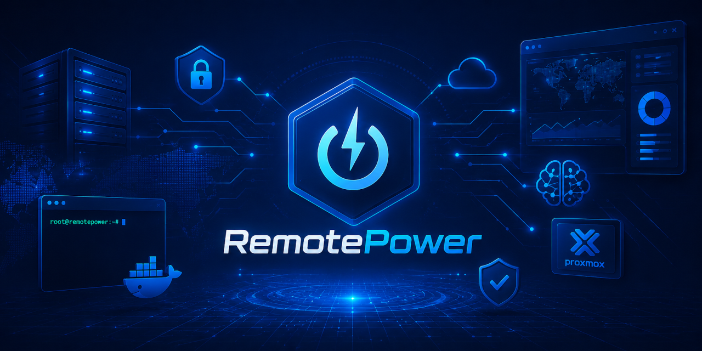

**The all-in-one, Swiss-army-knife control plane for your Linux fleet — and your homelab.**
Monitoring with alerting, a CMDB, documentation with RAG search, CVE scanning, patching
and remote management in one self-hosted place — with AI woven through all of it (optional).
Web dashboard, push-based agents, no inbound ports. Set it up in five minutes.

[](LICENSE)
[](https://kernel.org)
[](docs/install.md#docker-one-liner-alternative)
[](https://nginx.org)
[](https://python.org)
[](https://github.com/tyxak/remotepower/releases)
[](https://github.com/tyxak/remotepower/wiki)
[](https://github.com/tyxak/remotepower/discussions)

[Live demo](https://demoremote.tvipper.com) · [Install](docs/install.md) · [Features](docs/features.md) · [Wiki](https://github.com/tyxak/remotepower/wiki) · [Discussions](https://github.com/tyxak/remotepower/discussions)

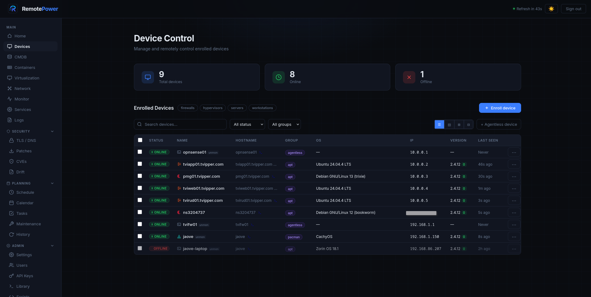

<details>
<summary><b>Click-through gallery — more screenshots</b></summary>

<br>

<table>
<tr>
<td align="center"><b>Dashboard</b><br><a href="docs/screenshots/Dash.png">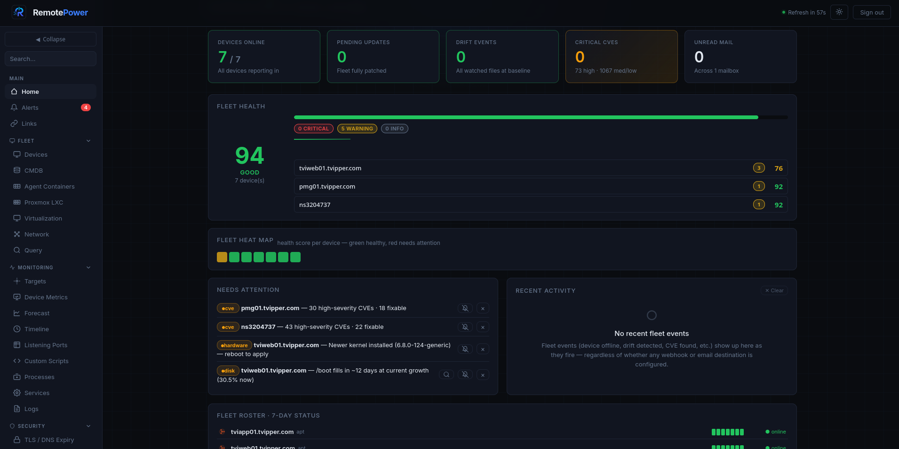</a></td>
<td align="center"><b>Device drawer</b><br><a href="docs/screenshots/Click_menu.png">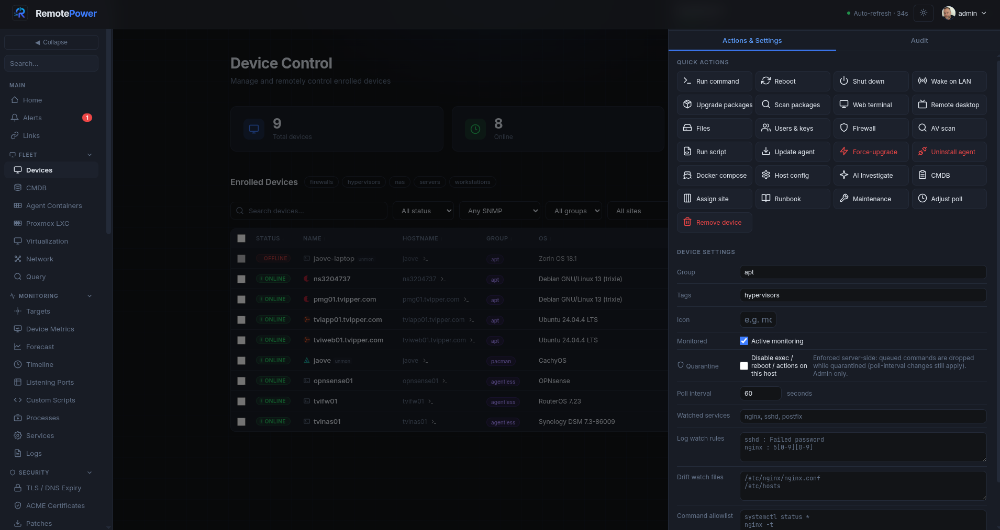</a></td>
</tr>
<tr>
<td align="center"><b>Browser SSH terminal</b><br><a href="docs/screenshots/Terminal.png">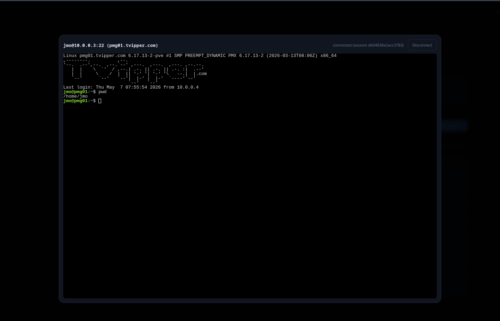</a></td>
<td align="center"><b>Monitoring</b><br><a href="docs/screenshots/Monitoring.png"></a></td>
</tr>
<tr>
<td align="center"><b>Device metrics</b><br><a href="docs/screenshots/Metrics.png">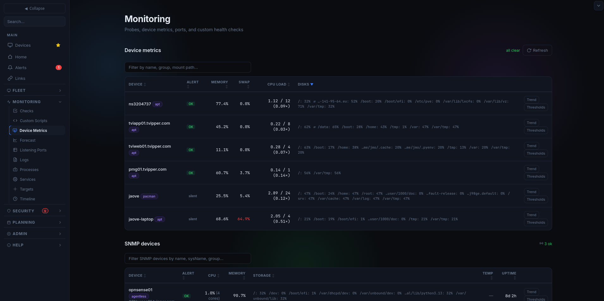</a></td>
<td align="center"><b>Logs</b><br><a href="docs/screenshots/Logs.png">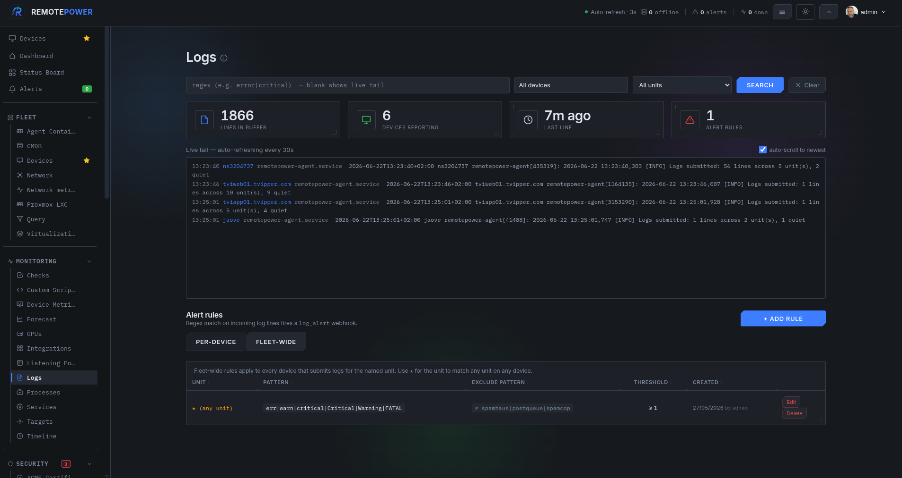</a></td>
</tr>
<tr>
<td align="center"><b>CVEs</b><br><a href="docs/screenshots/CVE.png">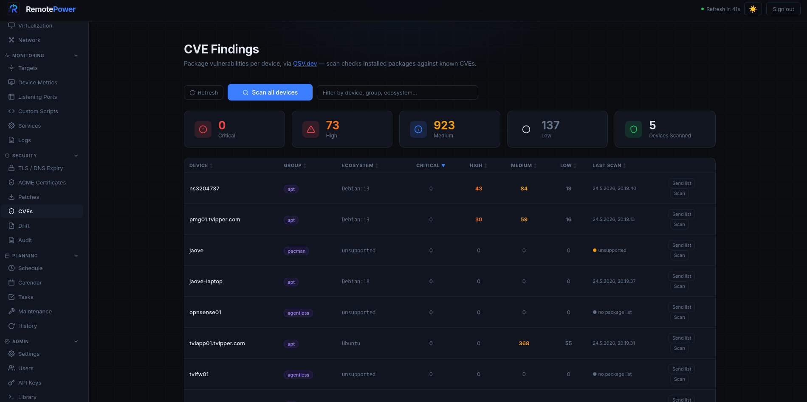</a></td>
<td align="center"><b>Patches</b><br><a href="docs/screenshots/Patches.png">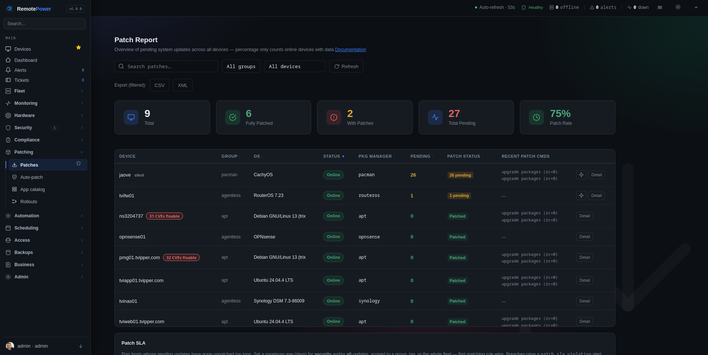</a></td>
</tr>
<tr>
<td align="center"><b>Custom scripts</b><br><a href="docs/screenshots/Scripts.png">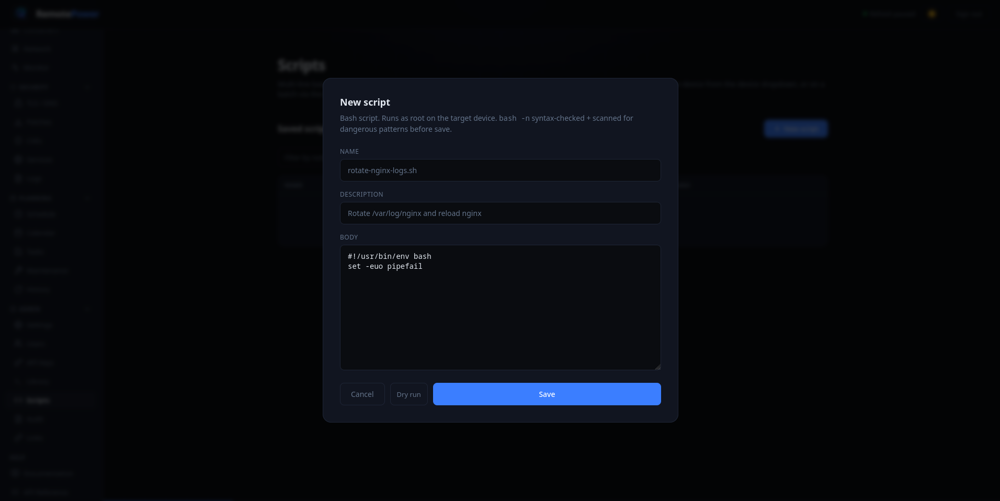</a></td>
<td align="center"><b>Software center &amp; policy</b><br><a href="docs/screenshots/Software.png">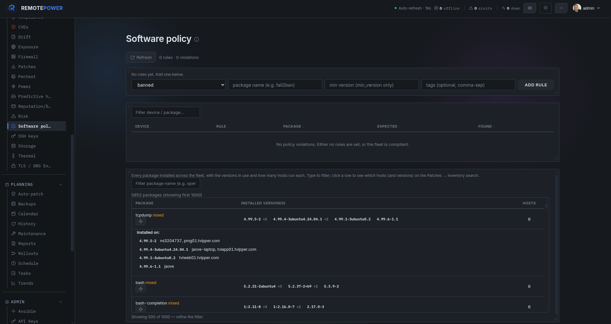</a></td>
</tr>
<tr>
<td align="center"><b>Release signing</b><br><a href="docs/screenshots/Signing.png">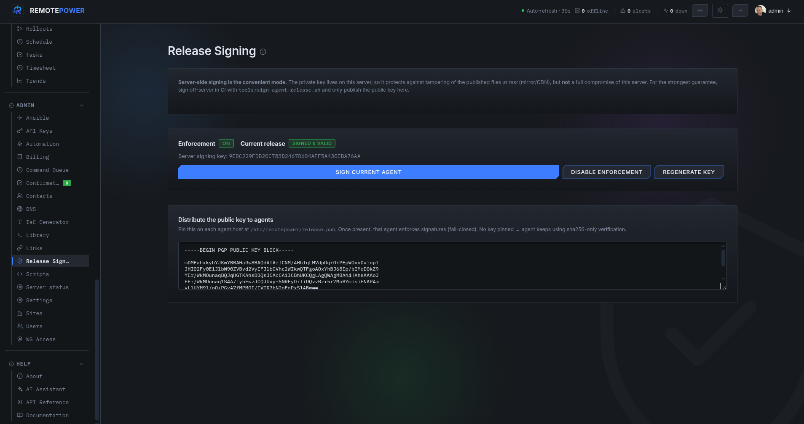</a></td>
<td align="center"><b>CMDB</b><br><a href="docs/screenshots/CMDB.png">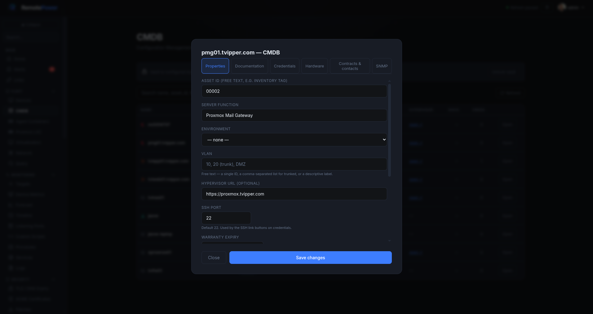</a></td>
</tr>
<tr>
<td align="center"><b>Proxmox snapshots</b><br><a href="docs/screenshots/Snapshots.png">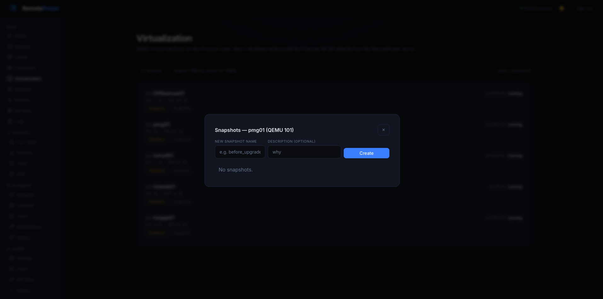</a></td>
<td align="center"><b>IaC generator</b><br><a href="docs/screenshots/IaC.png">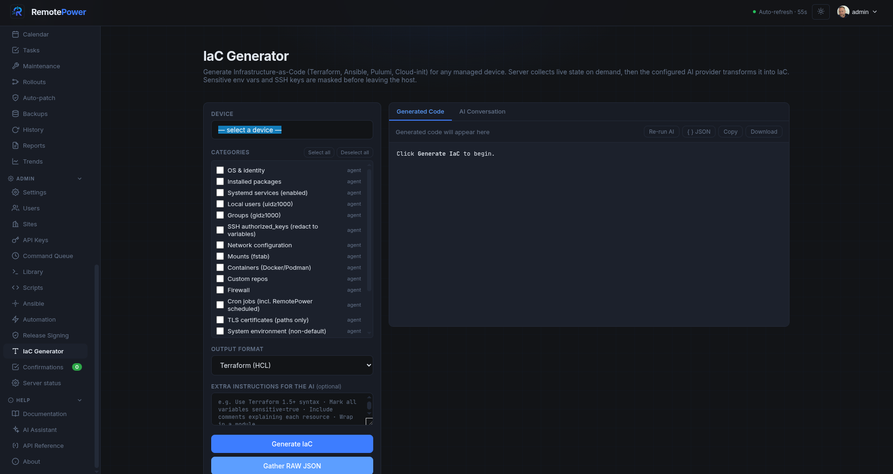</a></td>
</tr>
<tr>
<td align="center"><b>Settings</b><br><a href="docs/screenshots/Settings.png"></a></td>
<td align="center"><b>AI assistant</b><br><a href="docs/screenshots/AI.png">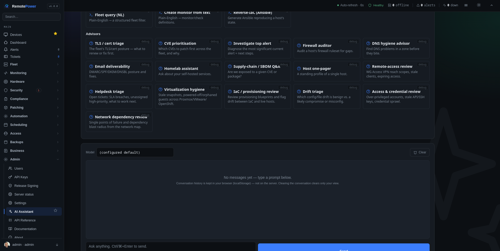</a></td>
</tr>
<tr>
<td align="center"><b>Claude (AI host integration)</b><br><a href="docs/screenshots/Claude.png">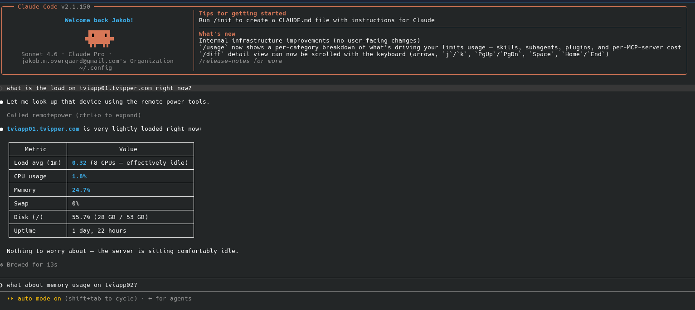</a></td>
</tr>
</table>

</details>

</div>

---

## What is it?

**One tool instead of six.** Most teams stitch together a monitor, a CMDB, a wiki,
a vulnerability scanner, a patch tool and an SSH jump box. RemotePower is the
Swiss-army-knife that does all of it from a single host you control — **monitoring
&amp; alerting**, an asset **CMDB**, **documentation with RAG search** over your own
fleet, **CVE scanning**, **patching**, and **remote management** — and it's **heavily
bound to AI as an option**: bring your own model (local Ollama/LocalAI or a cloud
provider) and ask questions answered from *your* infrastructure, or leave it off
entirely. Everything stays self-hosted.

A web dashboard that manages your Linux machines (and Windows, kind of) without
opening firewall ports on them. Each host runs a small Python agent that **polls**
the central server every 60 seconds — outbound HTTPS only. Enrolment is a 6-digit
PIN, like pairing a console controller.

Deliberately small and **readable**: nginx + Python CGI + flat JSON files — about
**60,000 lines** of server Python, one HTML file, one CSS file and a handful of
hand-written JS files. No external database, no Node.js, no Redis, no Kubernetes,
**no build step, no bundler, no framework** — you can read every line. The whole
`/var/lib/remotepower/` directory backs up with `tar`. Tested on real homelabs
running 5–50 devices, fine up to a few
hundred — and for larger or write-heavy fleets you can switch to an optional
embedded **SQLite** backend, or scale all the way to **PostgreSQL** (failover +
read replicas), load-balanced **app nodes** and **relay satellites** for segmented
networks. That's an **advanced, heavy-fleet** track — most installs never touch
it. See **[docs/scaling.md](docs/scaling.md)**.

## Quick start

**Server — one command, HTTPS out of the box:**

```bash
# Docker (recommended). Self-signed HTTPS on first boot; the one-time admin
# password is printed to `docker logs remotepower`.
docker compose up -d

# Or bare-metal: a single wizard installs nginx + the app + TLS + admin.
# You never edit an nginx file — it writes the vhost and certificate for you.
git clone https://github.com/tyxak/remotepower && cd remotepower
sudo bash install.sh
```

Open the printed URL and log in. HTTPS is automatic — a self-signed CA by
default (agents pin it), or a real Let's Encrypt cert when you give a public
domain. No cert wrangling, no nginx editing.

**Add a device — one line, nothing to configure:**

In the dashboard, *Add device → Quick install command*, then on the target host:

```bash
wget -qO- "https://your-server/install?t=<token>" | sudo sh
```

It downloads the **signed** agent, verifies its checksum, enrols with the baked
one-time token, and the host appears in the dashboard **by its hostname** within
~60 seconds. Prefer Docker? *Add device → Generate Docker compose*. Onboarding
many hosts? Push the installer over SSH: `install.sh agent push user@h1 user@h2 …`.

**Uninstall:** `sudo bash install.sh uninstall` (server — keeps your data;
`--purge` to wipe it) · `wget -qO- https://your-server/install | sudo sh -s -- --uninstall` (agent).

For longer paths (Windows client, demo vhost, Ansible, advanced TLS), see
**[docs/install.md](docs/install.md)**.

### Try the live demo

A read-only demo deployment runs at **<https://demoremote.tvipper.com>** —
seeded with synthetic devices, alerts, CVE findings, and metrics so you can poke
around without installing anything. Login: **`demo`** / **`demo`** (reset every
few hours, so feel free to break things).

## What you can do with it

One tool instead of six — the ten things it does best:

| | |
|---|---|
| **Monitor everything** | Live 60-second metrics, a CheckMK-style per-host **Checks** page, active monitors (HTTP / DNS / ICMP / TCP + credential-less DB liveness), and a composable dashboard. Every fired event lands in an **Alerts inbox** with acknowledge / auto-resolve. |
| **See every signal** | SMART & hardware health, **GPU** (NVIDIA + AMD, trend sparklines + thermal alerts), power / UPS, disk-fill **forecasting**, a per-host **timeline**, and logs with regex search — telemetry the agent already reports, surfaced as first-class views. |
| **Manage remotely** | Shell, multi-line scripts with dry-run lint, batch & scheduled runs, a real **browser SSH terminal**, **VNC** and **SFTP** over the same tunnel, **Proxmox** VM / LXC create, and host user / key / firewall edits — all with **zero inbound ports**. |
| **Lock it down** | Passkeys / WebAuthn, SAML / OIDC / LDAP, TOTP + recovery codes, per-role **MFA enforcement**, a **tamper-evident** (hash-chained) audit log, strict CSP, and SSRF-guarded outbound calls. |
| **Scan for CVEs** | OSV.dev-backed, CVSS-scored, prioritized by CISA **KEV** + **EPSS** (exploited-in-the-wild first), with **SBOM** export (CycloneDX / SPDX, VEX-style vulnerabilities embedded). |
| **Pentest what you own** | Authorized vulnerability scanning of your own hosts & domains — nuclei / nikto / nmap / **OWASP ZAP** / wapiti / lynis — on a hardened scanner satellite, authorization-gated and schedulable. |
| **CMDB + RAG search** | Asset DB, **encrypted credentials vault**, Markdown docs per asset, network map — and an AI assistant whose **RAG** answers from *your* fleet and docs and cites the source (local or cloud model; off by default). |
| **Stay compliant** | **OpenSCAP** CIS / STIG / PCI scans with downloadable HTML reports, plus PCI / HIPAA / SOC 2 control mapping and scheduled posture reports. |
| **Integrate** | 26 **homelab-app** health connectors (Pi-hole, TrueNAS, the *arr suite, …), Prometheus / Grafana / Uptime-Kuma endpoints, inbound webhooks & syslog, and an **MCP server** so an AI client can query your fleet. |
| **Patch & automate** | Auto-patch policies (cron, per group / tag / site, maintenance-aware), config-**drift** detection, ACME / Let's Encrypt, backup orchestration, and an **IaC generator** (Terraform / Ansible / Pulumi / …). |

**Full feature inventory → [docs/features.md](docs/features.md).**

### Recent releases

- **v4.7 — IntegrationsMatters** — 26 read-only homelab software integrations, a **containerized agent** (monitor a Docker host with no OS install), and a fleet **GPU** page (NVIDIA + AMD, trend sparklines + thermal alerting).
- **v4.6.1** — a stability + hardening patch (SCGI-worker ICMP / Postgres fixes, ReDoS, XSS, subtitle flash-of-text).
- **v4.6 — RepellantMatters** — the distinctive **Industrial** UI becomes the default, alongside a project-wide reliability, security and performance pass.

Full release history, newest first → **[CHANGELOG.md](CHANGELOG.md)**.

## Security

RemotePower is security-reviewed every few releases and **independently pentested
clean** — the latest full run (Bandit SAST; OWASP ZAP, Nikto, Nuclei, Wapiti,
WhatWeb DAST) reported **no exploitable findings**. Posture in brief: bcrypt
(cost 12, PBKDF2-HMAC-SHA256 fallback) behind rate-limited login; TOTP 2FA with
recovery codes; passkeys / SAML / OIDC / LDAP; 256-bit header session tokens
(CSRF-safe by construction); a strict CSP with no `'unsafe-inline'`; an AES-GCM
CMDB vault; a tamper-evident audit log; and mandatory TLS verification plus
connect-time anti-DNS-rebinding on every outbound call. Full posture, threat
model, review history and an operator hardening checklist:
**[docs/security.md](docs/security.md)**.

## Documentation

Browse the full docs in the **[Wiki](https://github.com/tyxak/remotepower/wiki)**
(generated from `docs/`, organised by topic). Prefer the source? Everything lives
in **[docs/](docs/)** — start with the index there. The essentials:

| Topic | Where |
|---|---|
| **Install** (Linux, Docker, demo, Windows) | [docs/install.md](docs/install.md) |
| **Full feature inventory** | [docs/features.md](docs/features.md) |
| **Architecture + on-disk layout** | [docs/architecture.md](docs/architecture.md) |
| **API reference** (endpoints + OpenAPI) | [docs/api.md](docs/api.md) — interactive: `/swagger.html` |
| **Security notes** | [docs/security.md](docs/security.md) |
| **Scaling & deployment** | [docs/scaling.md](docs/scaling.md) |
| **Troubleshooting / Upgrading** | [docs/troubleshooting.md](docs/troubleshooting.md) · [docs/upgrading.md](docs/upgrading.md) |

## TL;DR

A self-hosted Swiss-army knife for your Linux fleet or homelab: monitoring,
alerting, CMDB, docs with **RAG**, CVE scanning, authorized pentesting, patching,
compliance, and full remote management (browser SSH, Proxmox, files) — push-based
agents, **zero inbound ports**, optional **local or cloud AI** that answers from
*your* hosts. One tool instead of six.

## Contributing & community

- **Request a feature** — open a [Feature request](https://github.com/tyxak/remotepower/issues/new?template=feature_request.yml); it's labelled `enhancement` and triaged from there.
- **Report a bug** — open a [Bug report](https://github.com/tyxak/remotepower/issues/new?template=bug_report.yml).
- **Ask a question or float an idea** — head to [Discussions](https://github.com/tyxak/remotepower/discussions).
- **Found a security issue?** — please report it privately per [SECURITY.md](SECURITY.md); don't open a public issue.
- **Contributing code or docs?** — see [CONTRIBUTING.md](CONTRIBUTING.md).

## License

MIT — see [LICENSE](LICENSE).

<div align="center"><sub>Made with care and vi</sub></div>
