# RemotePower

<div align="center">

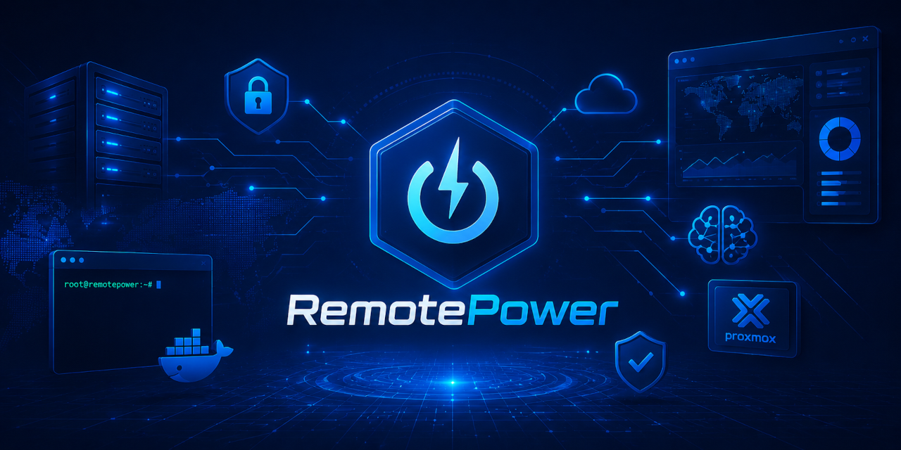

**The Swiss-army-knife control plane for your Linux fleet — Windows and macOS
too — or your homelab.** Monitoring, alerting, a CMDB, CVE scanning, patching,
compliance, a built-in helpdesk, and remote management, all self-hosted in one
place — with optional AI woven through it. Push-based agents that run as a
supervised service on every OS, zero inbound ports — and agentless receivers
(syslog, NetFlow, SNMP) for the boxes that can't run one. Up and running in
five minutes.

[](LICENSE)
[](https://kernel.org)
[](docs/install.md#docker-one-liner-alternative)
[](https://nginx.org)
[](https://python.org)
[](https://github.com/tyxak/remotepower/releases)
[](https://github.com/tyxak/remotepower/wiki)
[](https://github.com/tyxak/remotepower/discussions)

[Live demo](https://demoremote.tvipper.com) · [Install](docs/install.md) · [Wiki](https://github.com/tyxak/remotepower/wiki) · [Changelog](CHANGELOG.md) · [Discussions](https://github.com/tyxak/remotepower/discussions) · [The story](HISTORY.md)

<a href="https://demoremote.tvipper.com"></a>

<details>
<summary><b>Screenshots</b></summary>
<br>
<table>
<tr>
<td align="center"><b>Dashboard</b><br><a href="docs/screenshots/Dash.png">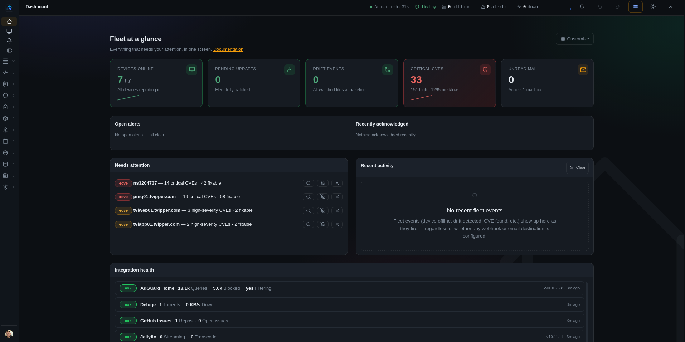</a></td>
<td align="center"><b>Fleet overview</b><br><a href="docs/screenshots/Index.png">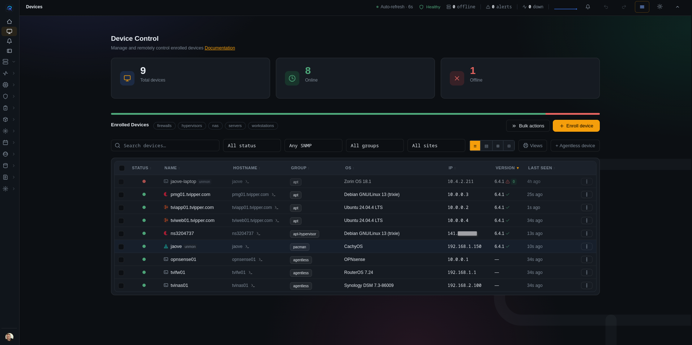</a></td>
</tr>
<tr>
<td align="center"><b>Monitoring</b><br><a href="docs/screenshots/Monitoring.png">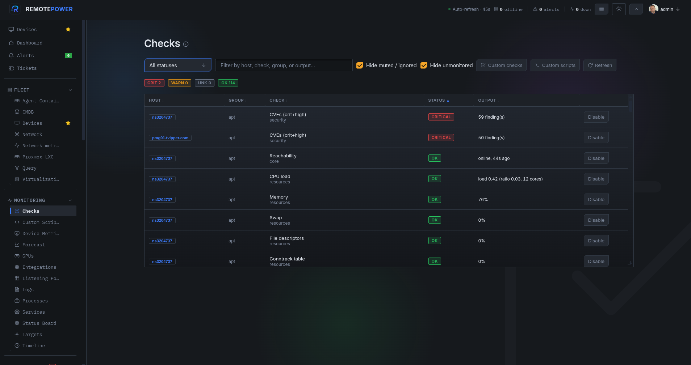</a></td>
<td align="center"><b>Device metrics</b><br><a href="docs/screenshots/Metrics.png">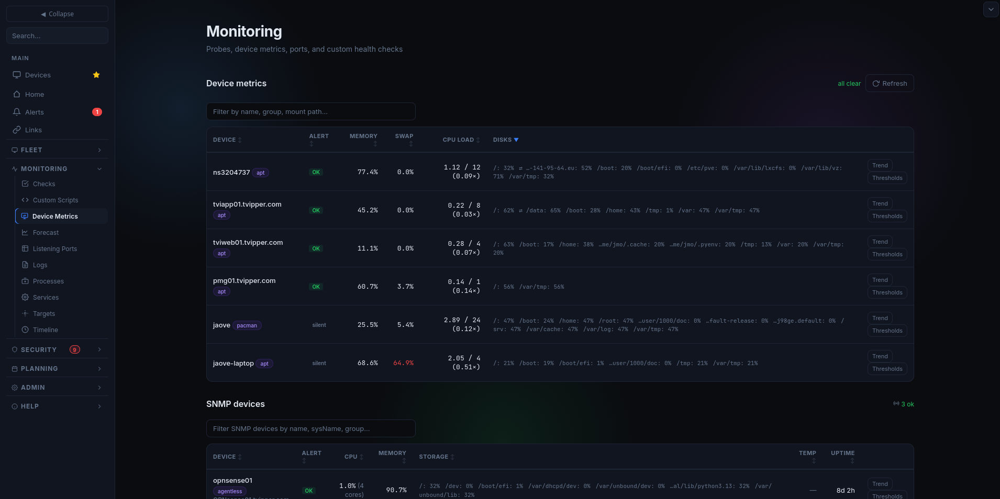</a></td>
</tr>
<tr>
<td align="center"><b>CVEs</b><br><a href="docs/screenshots/CVEs.png">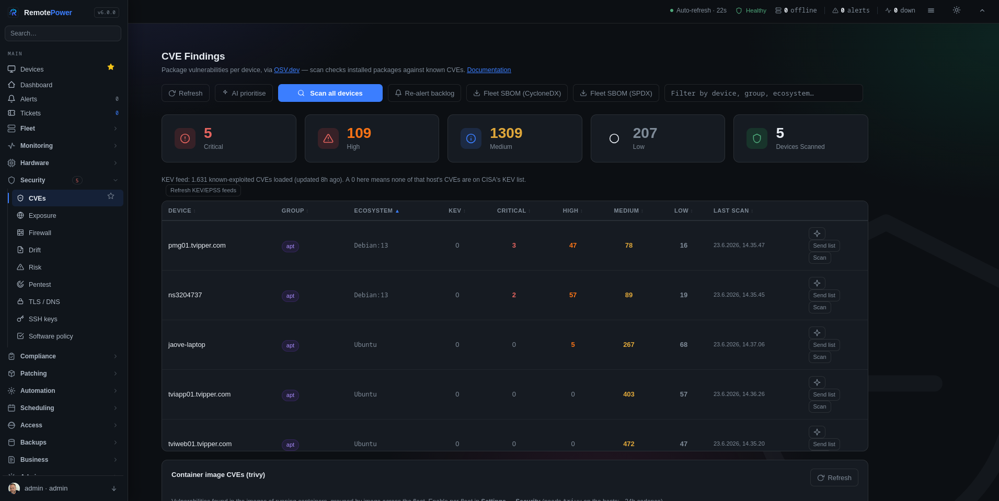</a></td>
<td align="center"><b>Patches</b><br><a href="docs/screenshots/Patches.png">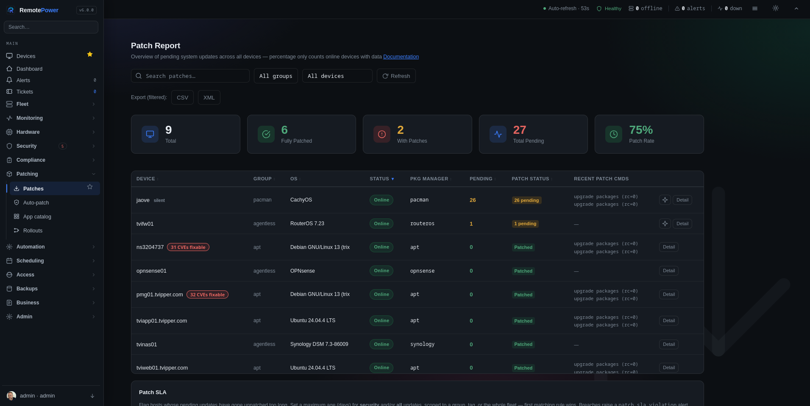</a></td>
</tr>
<tr>
<td align="center"><b>Compliance</b><br><a href="docs/screenshots/Compliance.png">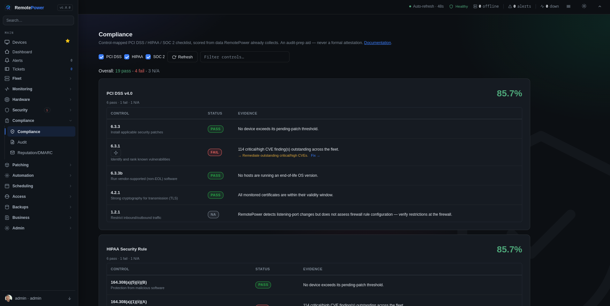</a></td>
<td align="center"><b>Pentest</b><br><a href="docs/screenshots/Pentest.png">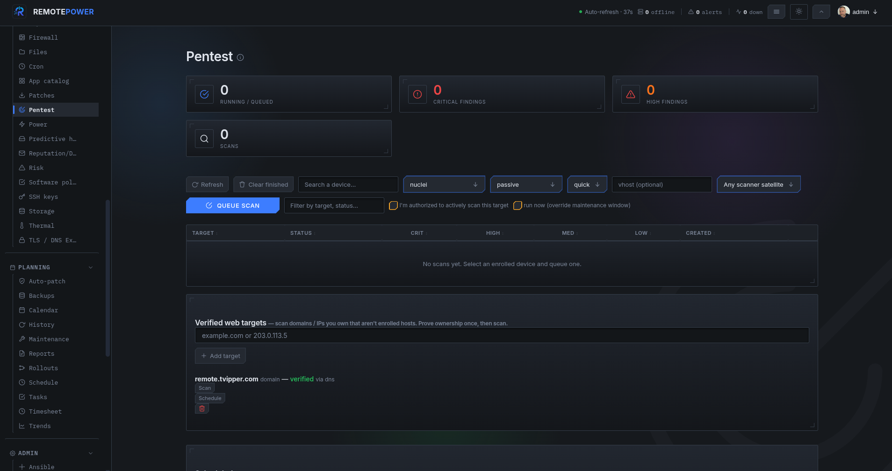</a></td>
</tr>
<tr>
<td align="center"><b>CMDB</b><br><a href="docs/screenshots/CMDB.png">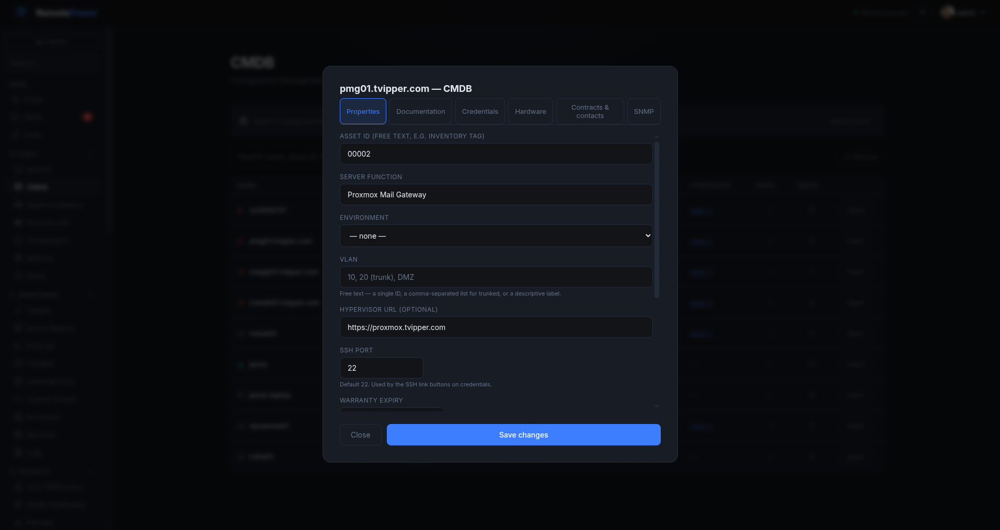</a></td>
<td align="center"><b>Settings</b><br><a href="docs/screenshots/Settings.png">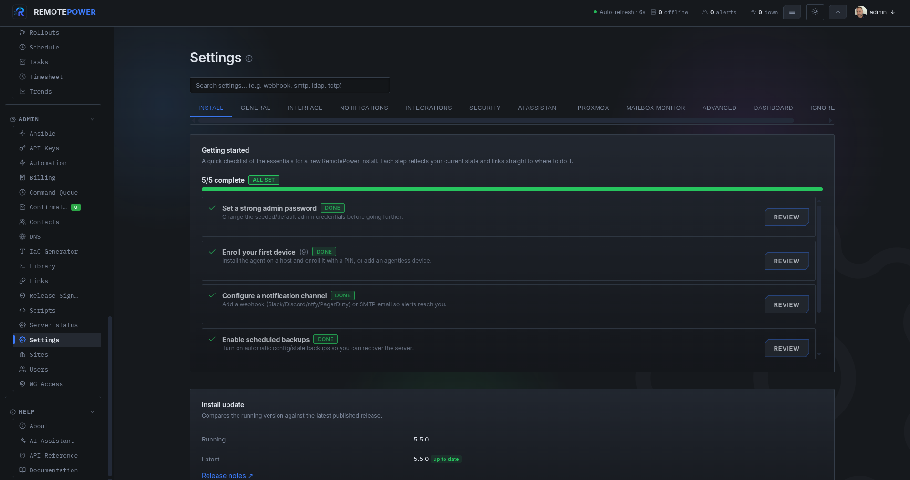</a></td>
</tr>
<tr>
<td align="center"><b>AI assistant</b><br><a href="docs/screenshots/AI.png">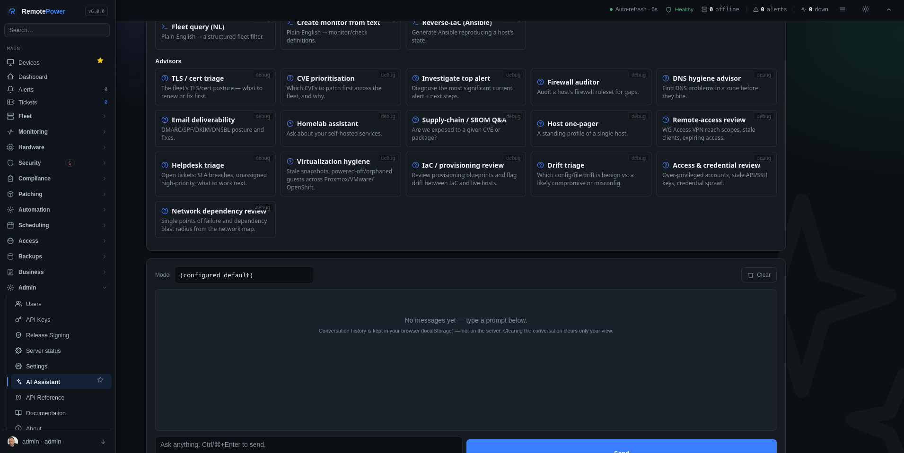</a></td>
<td align="center"><b>Tickets (helpdesk)</b><br><a href="docs/screenshots/Tickets.png">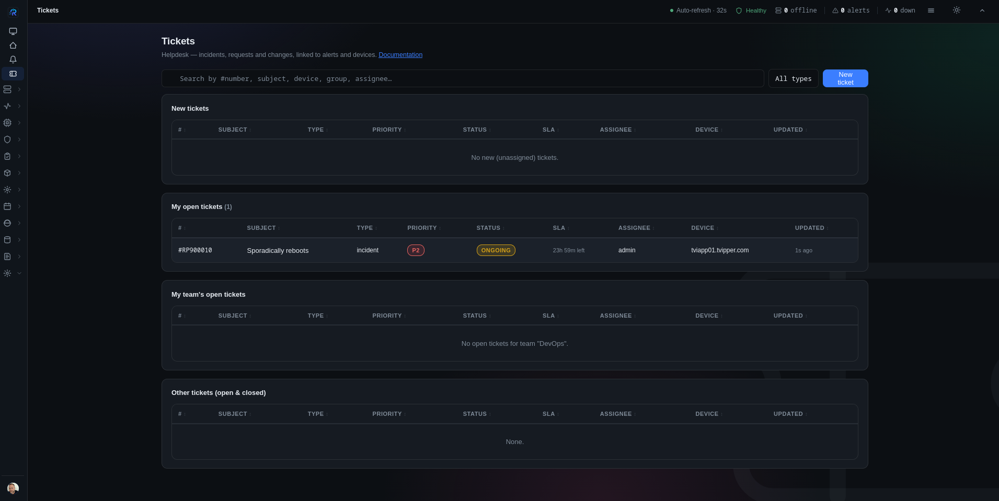</a></td>
</tr>
<tr>
<td align="center"><b>Calendar</b><br><a href="docs/screenshots/Calendar.png">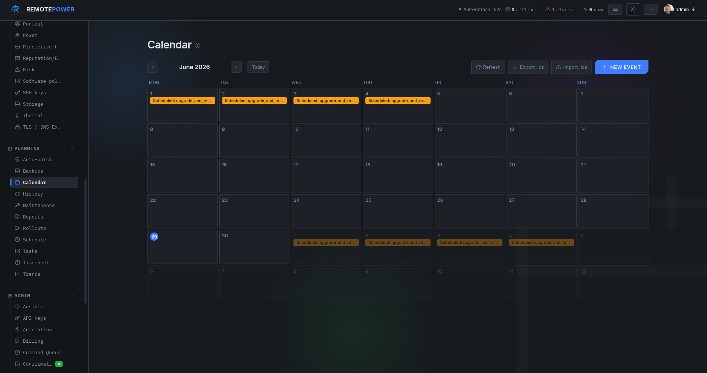</a></td>
<td align="center"><b>WG Access (VPN)</b><br><a href="docs/screenshots/WG.png">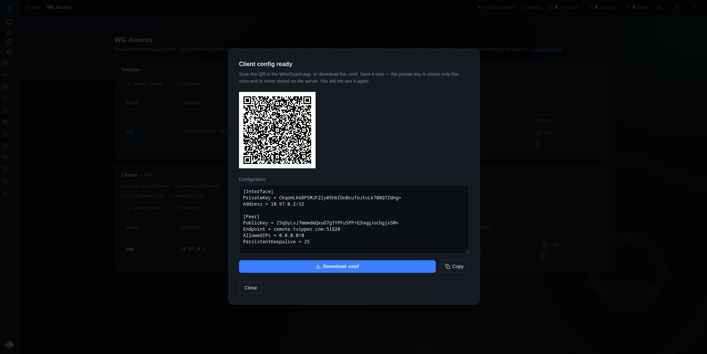</a></td>
</tr>
<tr>
<td align="center"><b>Browser SSH terminal</b><br><a href="docs/screenshots/Terminal.png">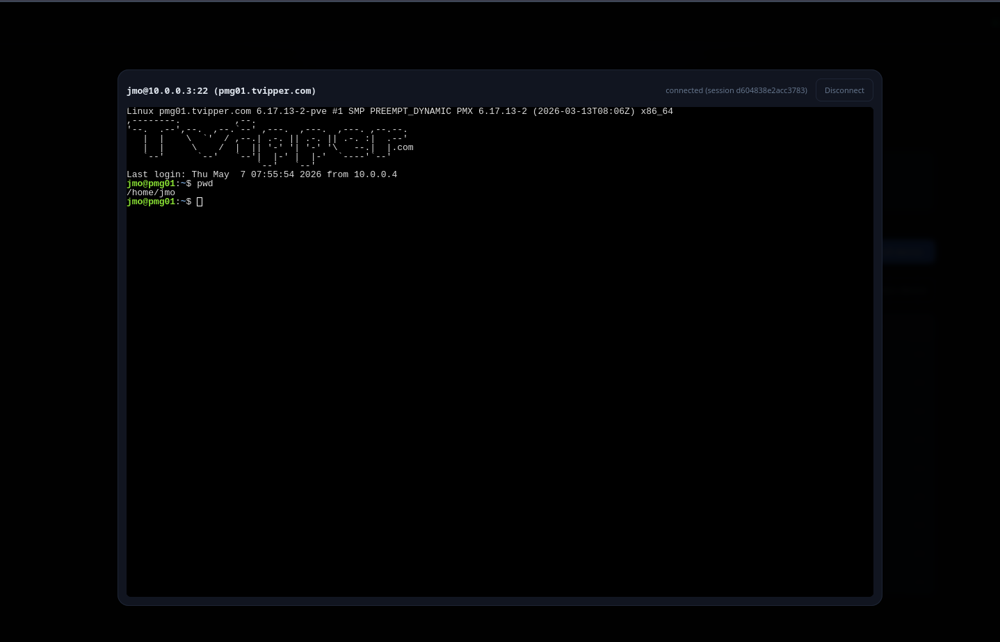</a></td>
<td align="center"><b>rp — node control (TUI)</b><br><a href="docs/screenshots/TUI.png">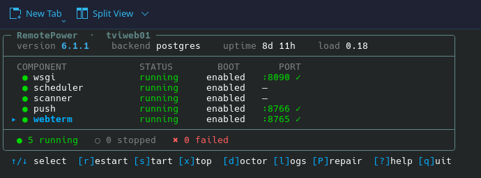</a></td>
</tr>
<tr>
<td align="center"><b>Containers</b><br><a href="docs/screenshots/Containers.png">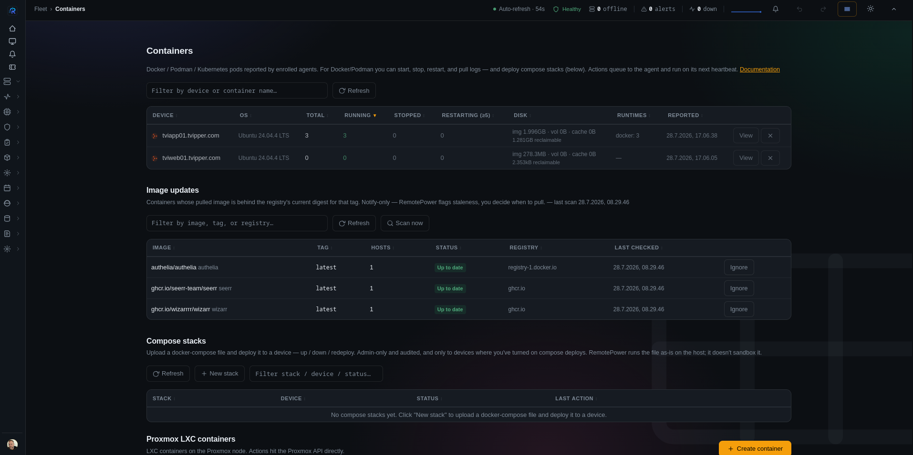</a></td>
<td align="center"><b>KMIP key server</b><br><a href="docs/screenshots/KMIP.png">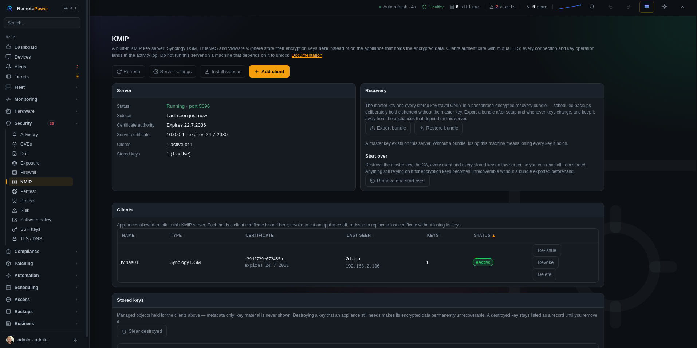</a></td>
</tr>
</table>
</details>

</div>

---

## What is it?

Most teams stitch together a monitor, a CMDB, a wiki, a vulnerability scanner,
a patch tool, a ticket system and an SSH jump box. RemotePower is one
self-hosted tool that does all of it — monitoring & alerting, an asset CMDB,
documentation with RAG search over your own fleet, CVE scanning, patching,
compliance reporting, a helpdesk with SLA clocks and email in/out, and remote
management — with AI as an entirely optional layer on top (bring your own
local or cloud model, or leave it off; when enabled it can also *triage* an
alert through a bounded, read-only investigation loop and write a verdict
with its evidence).

Each host runs a small Python agent that polls the server over outbound
HTTPS only — nothing opens on the client, ever. Enrolment is a 6-digit PIN,
like pairing a controller. It runs supervised on every platform — a systemd
service on Linux, a launchd agent on macOS, and a **Windows service**
(services.msc, auto-restarting) on Windows, installed by a single elevated
one-liner. See [docs/windows-client.md](docs/windows-client.md) for the Windows
specifics.

Small and readable on purpose: nginx + Python (gunicorn/Flask) on the
server, plain vanilla JS in the browser — no React/Vue, no build step, no
Node.js, no Redis, no Kubernetes. `install-server.sh` or `docker compose up`
provisions the full stack — PostgreSQL, the app server, a maintenance
scheduler, a scanner satellite — with no flags required. A single small box
handles a couple hundred devices out of the box, no tuning needed — and the
*same* box carries several thousand agents with just the poll-interval and
worker-count knobs turned, before you'd ever reach for load-balanced app
nodes, read replicas or relay satellites. See
**[docs/scaling.md](docs/scaling.md)** for the capacity table and
**[docs/requirements.md](docs/requirements.md)** for hardware sizing.

## Quick start

**Server — one command, HTTPS out of the box:**

```bash
# Docker (recommended). Self-signed HTTPS on first boot; the one-time admin
# password is printed to `docker logs remotepower`.
docker compose up -d

# Or bare-metal: one wizard installs nginx + the app + TLS + admin.
git clone https://github.com/tyxak/remotepower && cd remotepower
sudo bash install.sh
```

Open the printed URL and log in — HTTPS is automatic (self-signed by
default, or Let's Encrypt if you give it a public domain). No nginx editing.

On the box, manage the stack with **`rp`** (omd/checkmk-style): `rp status`, the
live `rp tui` dashboard, and `sudo rp doctor` for a one-shot health check — see
[docs/cli.md](docs/cli.md).

**Add a device — one line:**

*Add device → Quick install command* in the dashboard, then on the target host:

```bash
wget -qO- "https://your-server/install?t=<token>" | sudo sh
```

The host appears in the dashboard within ~60 seconds. Onboarding many hosts?
`install.sh agent push user@h1 user@h2 …` pushes it over SSH.

**Upgrading?** `git pull origin main && sudo bash install.sh update` handles
both a plain code update and a legacy pre-6.1.0 conversion. Full paths
(Windows/macOS agents, demo vhost, advanced TLS, uninstall) →
**[docs/install.md](docs/install.md)** · **[docs/upgrading.md](docs/upgrading.md)**.

**Try it first:** a read-only demo runs at
**[demoremote.tvipper.com](https://demoremote.tvipper.com)**, seeded with
synthetic devices/alerts/CVEs. Login `demo` / `demo`, reset every few hours.

## What you can do with it

- **Monitor & alert** — live metrics, a CheckMK-style Checks page, active
  monitors (HTTP/DNS/ICMP/TCP) with attachable SLA/SLO objects (availability
  targets + error budgets), an Alerts inbox with ack/auto-resolve/mute, and
  one filterable page to tune every alert threshold, grade and score weight.
- **See every signal** — SMART/hardware health, CPU/board temperatures, GPU,
  power/UPS, disk-fill forecasting, a per-host timeline, log search; agentless
  syslog, NetFlow/IPFIX/sFlow and SNMP receivers (plus an OID browser to walk
  any SNMP subtree) cover the switches, firewalls and printers that can't run
  an agent.
- **Manage remotely** — shell + Custom Scripts on Linux, Windows and macOS, a
  file manager and cron/systemd-timer control with zero inbound ports; plus a
  browser SSH terminal and VNC riding your existing SSH, and
  Proxmox/VMware/OpenShift guest lifecycle via the hypervisor's own API.
- **Lock it down** — passkeys/WebAuthn, SAML/OIDC/LDAP, TOTP, per-role MFA,
  a tamper-evident audit log, strict CSP, an instance-wide view of who is
  signed in right now — and a built-in KMIP key server so NAS/hypervisor
  encryption keys live off the appliance they unlock. It grades its own host's
  disk encryption too, since that is where every device token and the
  credential vault live.
- **Scan for CVEs** — OSV.dev-backed, CISA KEV + EPSS prioritized, SBOM
  export (CycloneDX/SPDX).
- **Pentest what you own** — authorized nuclei/nikto/nmap/ZAP/wapiti/lynis
  scans on a hardened scanner satellite.
- **CMDB + RAG search** — assets, an encrypted credentials vault, a
  Knowledge Base, and an AI assistant that cites *your* fleet's own data.
- **Stay compliant** — OpenSCAP CIS/STIG/PCI scans, PCI/HIPAA/SOC 2 mapping.
- **Integrate** — 44 connectors (homelab apps, hypervisors, and EDR — Wazuh,
  CrowdStrike, SentinelOne — cross-referenced to find hosts with no EDR at all)
  plus a code-free custom-HTTP-probe plugin, Prometheus/Grafana endpoints,
  webhooks, syslog, and an MCP server.
- **Deploy & automate** — a one-click app catalog, auto-patch policies,
  drift detection, ACME, backups, and a Terraform/Ansible provisioning catalog.

**Full feature inventory → [docs/features.md](docs/features.md).**
**Step-by-step recipes → [docs/cookbook.md](docs/cookbook.md).**

### Recent releases

- **v7.0.0 "Aut0nomyMatters"** — the major number is for **autonomous
  remediation**, and the design point is that you grade it before it is allowed
  to act. Every tenant starts *off*; you move one to **shadow**, where the loop
  reaches a real verdict and writes a **receipt** without touching anything, and
  you read those for a few weeks first. It acts on **precedent from your own
  incident memory** — what actually closed this exact signature on this fleet
  before — never on a model's improvisation, and before acting it works out
  **what goes dark**: monitors, containers, watched services, network
  neighbours, discounted when the host has healthy siblings. That preview stands
  on its own whether or not autonomy is switched on. **24 action classes**, and
  an event maps to an ordered *ladder* of them, so which remedy runs is your
  decision; commands go out in the same grammar an operator's own actions use,
  inheriting maintenance mode, quarantine, audit mode and the approval queue.
  Destructive actions require a backup **proven recoverable** — a restore drill
  that actually restored and verified, not one that merely ran.
  The rest of the release is the checks rather than the code they check. Six
  guardrails were reporting success while measuring nothing: the **Postgres
  backend** — the enterprise default — was run by no gate at all while 28 tests
  written for it skipped themselves for want of a server; undefined-name
  detection returned 238 findings on the server of which every one was a false
  positive; the accessibility sweep walked all 74 pages against an **empty
  database**, so anything living in a populated row was invisible to it. Plus
  the surfaces that told you something untrue — a green "queued" toast on an
  action the server had refused, enrollment PINs documented as single-use that
  were not, "?" in push notifications — and an interface pass that found the
  icon-spacing rule matching none of the ~195 buttons it was written for.
  Fixing the checks then found the bugs behind them: the **encryption-at-rest
  compliance control could never pass on a Linux fleet** (it read BitLocker and
  FileVault and nothing else), the **memory/swap/CPU saturation forecast raised
  no alert at all**, **SMART polling woke every sleeping disk** every five
  minutes, **143 confirmation dialogs had no name** a screen reader could
  announce, and on multi-tenant installs an **SSO login could quietly become a
  cross-tenant platform operator**.
- **v6.4.2 "Ver1tyMatters"** — a truth-in-reporting release. **Per-container
  alert mutes** (silence one container without silencing its host) and a real
  container **log window**, then a long correctness pass: an adversarial audit
  closed a **cross-tenant log-content leak**, a governance switch a config
  import could flip, and a webhook credential that shipped in clear text. A
  **data-binding sweep** put Linux firewall / SSH / auto-update posture on the
  Checks page, into fleet-query, and behind PCI 1.2.1, and made
  **Windows/macOS endpoint posture feed the risk score**. **Security hardening
  is now opt-in** (Settings → Security) — the advisory checks that flag things
  plenty of fleets choose on purpose are off by default, and alert only once
  you turn them on.
- **v6.4.1 "Cust0dyMatters"** — key custody: a built-in **KMIP key server** so a
  Synology NAS, TrueNAS box or vSphere cluster stops keeping its encryption keys
  on the same hardware that holds the encrypted data. Off by default, a separate
  sandboxed sidecar, mutual TLS only, with an encrypted recovery bundle. Plus
  installer flags for the optional syslog/flow receivers, an INGEST & KEYS view
  in `rp status`/`rp tui`, and two monitor fixes: an actionable rejection message
  and one stale monitor no longer blocking every other monitor edit.
## Security

Security-reviewed every release and pentested as hard as we can — the bar is
**nothing Critical, High or Medium ships, and nothing exploitable**. Every
release runs SAST (Bandit, gitleaks, Semgrep, and CodeQL — the same
advanced-setup scan GitHub runs, all reporting clean), adversarial code review,
DAST (OWASP ZAP, Nikto, Nuclei, Wapiti, WhatWeb), and live probing of our own
instance. Release tarballs are GPG-signed and the container images are
cosign-signed (keyless, verifiable against the release workflow's identity).
bcrypt-hashed
passwords behind rate-limited login, TOTP/passkeys/SAML/OIDC/LDAP, a strict CSP
with no `unsafe-inline` (plus HSTS preload, frame-ancestors `none`, and a locked
permissions-policy), an AES-GCM CMDB vault, a tamper-evident audit log, signed
agent commands, and mandatory TLS verification with anti-DNS-rebinding on every
outbound call. Each release's write-up is public. Full posture, threat model
and review history → **[docs/security.md](docs/security.md)**.

## Documentation

The **[Wiki](https://github.com/tyxak/remotepower/wiki)** is the browsable,
topic-organised home for everything — install guides, the full feature
reference, architecture, and the changelog. Prefer the source? It's all in
**[docs/](docs/README.md)** too. Quick links:

| Topic | Where |
|---|---|
| Install (Linux, Docker, Windows, macOS) | [docs/install.md](docs/install.md) |
| Full feature inventory | [docs/features.md](docs/features.md) |
| Architecture + on-disk layout | [docs/architecture.md](docs/architecture.md) |
| API reference (OpenAPI) | [docs/api.md](docs/api.md) — interactive: `/swagger.html` |
| Security notes | [docs/security.md](docs/security.md) |
| Scaling & deployment | [docs/scaling.md](docs/scaling.md) |
| Minimum/recommended hardware | [docs/requirements.md](docs/requirements.md) |
| Troubleshooting / Upgrading | [docs/troubleshooting.md](docs/troubleshooting.md) · [docs/upgrading.md](docs/upgrading.md) |

## Contributing & community

- **Request a feature** — open a [Feature request](https://github.com/tyxak/remotepower/issues/new?template=feature_request.yml).
- **Report a bug** — open a [Bug report](https://github.com/tyxak/remotepower/issues/new?template=bug_report.yml).
- **Ask a question or float an idea** — head to [Discussions](https://github.com/tyxak/remotepower/discussions).
- **Found a security issue?** — report it privately per [SECURITY.md](SECURITY.md); don't open a public issue.
- **Contributing code or docs?** — see [CONTRIBUTING.md](CONTRIBUTING.md).

Full history, newest first → **[CHANGELOG.md](CHANGELOG.md)**.

## License

MIT — see [LICENSE](LICENSE).

<div align="center"><sub>Made with care and vi</sub></div>
